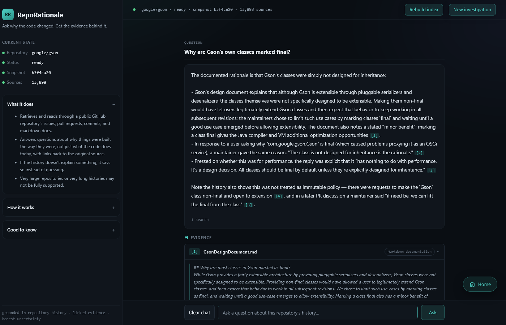

# RepoRationale

> Ask why the code changed. Get the evidence behind it.

RepoRationale is a local, evidence-grounded agentic RAG application that
indexes the decision history of a public GitHub repository and answers "why"
questions with inspectable citations or an explicit insufficient-evidence
result.

[](https://github.com/sophiatheofanidou/RepoRationale/actions/workflows/ci.yml)

<p align="center">
  <a href="docs/product-walkthrough.md">Product walkthrough</a> ·
  <a href="docs/evaluation.md">Evaluation</a> ·
  <a href="docs/architecture.md">Architecture</a> ·
  <a href="#quick-start">Quick start</a>
</p>

<p align="center">
  
</p>
<p align="center"><em>A grounded answer with the supporting repository evidence available for inspection.</em></p>

## Why RepoRationale

Source code usually shows what a system does, but not why a restriction,
workaround, or design choice exists. That rationale may be scattered across
years of pull requests, issues, commit messages, review discussions, and
documentation.

RepoRationale indexes the complete supported history once and provides an
explicit evidence contract for every question:

- retrieval happens before the answering model can respond;
- searches and evidence-sufficiency assessments are captured in the run trace;
- the application permits at most three searches, including refinements;
- every citation must resolve to evidence retrieved during the current run;
- insufficient evidence is a structured result, not an invitation to guess.

These controls do not make hallucinations impossible or prove that every
cited interpretation is correct. They make retrieval, grounding, citation, and
answer failures distinguishable and testable. When the evidence retrieved from
the indexed history is insufficient, the system says so instead of inventing a
rationale.

A general coding agent with repository access can investigate history on
demand and may be simpler for a one-off question or a small repository.
RepoRationale does not claim that indexed retrieval always performs better. Its
value is a reusable, bounded, citation-validated workflow whose behaviour and
failures can be inspected and evaluated.

## How it works

1. Check one public repository and reuse a compatible completed snapshot when
   one is available.
2. If an index is required, collect the complete supported history only after
   explicit confirmation. Unsupported repositories are rejected rather than
   partially indexed.
3. Search first with the user's exact question, then allow the bounded agent to
   request narrower semantic searches when evidence is missing.
4. Return a citation-validated answer or report that the retrieved evidence is
   insufficient.

Example questions include:

- Why was this restriction introduced?
- Was this alternative tried or rejected before?
- Did a later decision supersede the original one?

The [product walkthrough](docs/product-walkthrough.md) shows the full interface,
including cold indexing, snapshot reuse, contextual follow-ups, explicit
abstention, rebuild confirmation, and alternative failure states.

## Measured, not just demonstrated

The evaluation used [`google/gson`](https://github.com/google/gson), Google's
mature Java JSON library, selected for its large, long-lived, and varied
repository history. A frozen configuration was run once against six answerable
questions and two unsupported-premise controls, with no retries. Separate
controlled experiments measured indexing and snapshot reuse.

| Measure | Recorded result |
| --- | ---: |
| Direct vector retrieval found expected evidence in the top five results | **6/6 answerable questions** |
| Correct `answered` / `insufficient_evidence` outcome | **8/8** |
| Malformed or unauthorized citations | **0** |
| Adequate claim support / citation completeness | **8/8 / 8/8** |
| Answers citing a predeclared expected source | **5/6** |
| Mean end-to-end answer latency | **15.14 s** |
| Estimated Anthropic cost for all eight answers | **$0.522605** |
| Cold index build for 13,898 sources and 17,484 chunks | **404.35 s** |
| Reopen completed index | **2.97 s, no document re-embedding** |

One answer was grounded but incomplete relative to the preferred evidence,
which is why expected-source coverage was 5/6 rather than 6/6. A bounded
post-run diagnostic isolated its first-query problem and led to the
exact-question-first workflow used by the release; the published held-out score
was not replaced or retried. The evaluation also records failed development
runs, cases where the lexical baseline won, and the limitations of the small
held-out set. No head-to-head comparison was run against a general coding agent
with access to the same history.

The complete staged method and results are in the
[evaluation](docs/evaluation.md).

## Quick start

RepoRationale requires [uv](https://docs.astral.sh/uv/getting-started/installation/)
and three personal credentials: a GitHub token, a Voyage API key, and an
Anthropic API key.

```bash
git clone https://github.com/sophiatheofanidou/RepoRationale.git
cd RepoRationale
uv sync --locked
```

Copy `.env.example` to `.env` on macOS or Linux:

```bash
cp .env.example .env
```

Or with PowerShell:

```powershell
Copy-Item .env.example .env
```

Fill in `GITHUB_TOKEN`, `VOYAGE_API_KEY`, and `ANTHROPIC_API_KEY`, then run:

```bash
uv run streamlit run src/reporationale/streamlit_app.py
```

RepoRationale uses **BYOK (bring your own keys)**. Indexing and answering use
the credentials and usage quotas of your own provider accounts and may incur
provider charges. The local `.env`, downloaded repository data, generated
indexes, and evaluation traces are excluded from version control.

For development verification:

```bash
uv run ruff check .
uv run ruff format --check .
uv run mypy
uv run pytest
```

## Architecture and engineering quality

RepoRationale is a Python modular monolith with separate interface,
application-workflow, domain, and provider-adapter boundaries. Its retrieval
and bounded agent orchestration are project-owned rather than hidden behind a
large orchestration framework.

| Role | First-release implementation |
| --- | --- |
| Runtime | [Python](https://www.python.org/) 3.13 modular monolith |
| User interface | [Streamlit](https://docs.streamlit.io/) |
| Repository source | [GitHub REST API](https://docs.github.com/en/rest) |
| Embeddings | [Voyage 4](https://docs.voyageai.com/docs/embeddings) |
| Vector retrieval | [Chroma](https://docs.trychroma.com/), persisted locally |
| Answering model | [Anthropic Claude](https://platform.claude.com/docs/en/models/overview), using `claude-opus-5` |
| Offline baseline | [BM25](https://en.wikipedia.org/wiki/Okapi_BM25), evaluation-only |
| Tooling | [uv](https://docs.astral.sh/uv/), [pytest](https://docs.pytest.org/), [Ruff](https://docs.astral.sh/ruff/), and [mypy](https://mypy-lang.org/) |

The release passes 741 automated tests, Ruff linting and formatting, strict
mypy checks across 89 source files, and the same quality gates in
[GitHub Actions](https://github.com/sophiatheofanidou/RepoRationale/actions/workflows/ci.yml).
The component model and technical contracts are documented in the
[architecture](docs/architecture.md).

## First-release scope

The first release supports one public GitHub repository at a time, complete
ingestion of supported pull-request, issue, commit-message, and Markdown
history, reusable local snapshots, bounded semantic retrieval, cited answers,
explicit abstention, and contextual follow-ups within one investigation.

It deliberately excludes private-repository access, other repository
platforms, multi-repository search, automatic synchronization, partial
indexing, durable conversation history, cloud or multi-user deployment, and
repository modification. These are product boundaries, not unfinished tasks.
The full scope is in the [project definition](docs/project.md), and the reasons
behind accepted choices are in the [decision log](docs/decisions.md).

## Documentation

| Document | Covers |
| --- | --- |
| [Project definition](docs/project.md) | Product scope, target user, and first-release boundaries |
| [Product walkthrough](docs/product-walkthrough.md) | Screenshots of the complete user-visible workflow |
| [Architecture](docs/architecture.md) | Components, contracts, boundaries, and lifecycle diagrams |
| [Evaluation](docs/evaluation.md) | Methodology, measurements, results, and limitations |
| [Decision log](docs/decisions.md) | Accepted choices, superseded decisions, and considered alternatives |
| [Implementation plan](docs/plan.md) | Completed milestones and final verification |
| [AI collaboration guide](AGENTS.md) | Human authority, agent roles, review, and Git ownership rules |
| [Claude implementation guide](CLAUDE.md) | Bounded implementation and handoff protocol |

## Development approach

Development was coordinated through a documented, human-owned workflow using
two AI agents with separate responsibilities: Codex for planning,
documentation, and independent review, and Claude for bounded implementation
tasks. Product and technical decisions, Git history, commits, tags, and
publication remained under explicit owner approval. The public collaboration
guides record this process without replacing the product, architecture,
decision, or evaluation documents as sources of truth.

## License

RepoRationale is available under the [MIT License](LICENSE).
