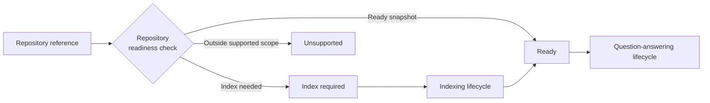
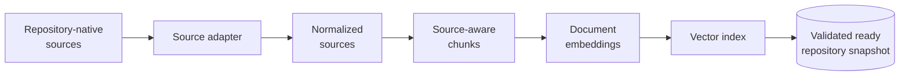
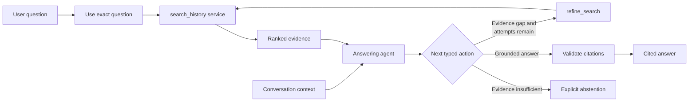
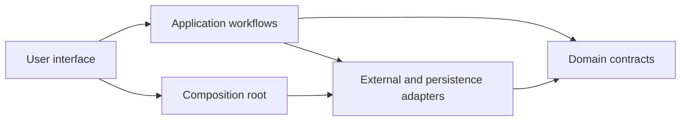

# RepoRationale: Architecture

This document describes the stable structure of RepoRationale: how repository
history becomes searchable evidence, how a question becomes a cited answer,
and which component owns each responsibility. The architecture is expressed in
technology-independent terms so that its roles and boundaries remain valid if
an implementation changes. The concrete technologies used by the first release
are identified separately in section 5.

RepoRationale is a modular monolith. It runs as one local application, while
the interface, workflows, domain contracts, and external integrations remain
separate and independently testable.

## 1. Architecture overview

The product has two primary lifecycles:

1. The **indexing lifecycle** prepares a reusable searchable snapshot of one
   repository revision.
2. The **question-answering lifecycle** retrieves evidence from a ready
   snapshot and produces a cited answer or an explicit abstention.

A repository-readiness check connects them:

The check validates the repository reference through its source platform,
resolves the current revision, inspects compatible local artifacts, and applies
admission policy when new source collection is required. Admission uses
inexpensive repository-size signals as workload proxies before indexing starts;
hard limits protect the actual build. These checks are support decisions, not
exact forecasts of duration, storage, or cost.

Temporary authentication, rate-limit, transport, timeout, or malformed-response
failures are a separate operational outcome. They are never reported as
`unsupported`, because failure to inspect a repository now does not establish
that the repository is outside the supported scope.

## 2. Indexing lifecycle

After explicit user confirmation, indexing runs with phase-level progress:

- **Repository-native sources:** the supported issues, completed changes and
  their discussion or review content, commit messages, and repository
  documentation.
- **Source adapter:** performs the platform-specific paginated requests and
  converts every independently citable item into the shared source contract.
  Bounded concurrency may overlap independent requests, but cannot change
  completeness, deterministic ordering, shared limits, or failure behaviour.
- **Normalized sources:** preserve stable identity, platform-native type,
  content, original URL, timestamps, state, and available relationships.
- **Source-aware chunks:** divide long sources into searchable passages while
  retaining the provenance required to cite the original item.
- **Document embeddings:** convert chunks into vectors through an embedding
  provider. Document requests may be batched and run with bounded concurrency;
  results return in source order. Query embedding remains a separate operation.
- **Vector index:** persists chunk vectors and the metadata required for
  similarity retrieval.

### Normalized source contract

`SourceDocument` is the platform-independent boundary returned by a source
adapter. It contains a platform-namespaced `source_id`, platform and repository
identifiers, an extensible platform-native `source_type`, non-empty text, the
original URL, optional timezone-aware timestamps, and optional title, item
number, parent identity, and metadata.

The contract is closed and immutable. External provider objects do not cross
this boundary, and a normalized source cannot be silently extended after
validation.

### Derived chunk contract

`SourceChunk` is the provider-independent retrieval unit derived from one
`SourceDocument`. Its stable ID combines the source ID with a zero-based
position. It repeats the provenance required by retrieval and citation,
including the original URL and relevant heading or discussion metadata.

Chunking respects source structure before applying a configured maximum size.
Document headings and block boundaries are preserved where possible, while
repository conversations retain their natural citation-addressable boundaries.
Chunk size and overlap are application configuration, not end-user choices.

### Snapshot integrity and publication

The normalized source corpus is the canonical rebuild input. Chunks,
embeddings, and the vector index are derived artifacts. Their manifests record
the schema, algorithm, count, and provider configuration needed for
compatibility checks.

Every artifact is built and validated in a staged location before publication.
A repository becomes ready only when its normalized corpus, chunks, and vector
index are mutually compatible and complete. A failed or interrupted build is
never queryable and never replaces a previous ready result. A compatible ready
snapshot can reopen without recollecting sources or re-embedding documents;
corruption fails explicitly instead of triggering hidden paid work.

### Retrieval contracts

The product retrieval path embeds a query using query semantics and searches
the active vector index. The vector store never creates embeddings itself, and
provider-specific types remain within their adapters.

The `search_history` application service accepts non-blank query text and
returns at most five `RankedEvidence` results. Each result is mapped by stable
chunk ID to the canonical persisted `SourceChunk`, rather than trusted from
vector-store metadata. A result has a one-based rank, a finite raw score, and a
score-kind label. Retrieval scores are not probabilities or model confidence
values.

An offline lexical baseline reads the same persisted chunks and returns the
same `RankedEvidence` contract. It exists only for reproducible comparison and
never participates in the product retrieval path. Scores retain
retriever-specific meanings and are not directly comparable across methods.

## 3. Question-answering lifecycle

Each question against a ready snapshot follows this bounded workflow:

- **Use exact question:** before invoking the answering model, the
  application calls `search_history` with the user's unchanged question. A
  later `refine_search` action calls that same service with a model-proposed
  query; `search_history` itself is not exposed as a model tool.
- **Conversation context:** the interface may supply up to three recent
  completed turns to resolve references, ellipsis, or topic. Prior answers are
  explicitly non-evidentiary and never alter the mandatory first query.
- **Answering agent:** after reviewing ranked evidence, the model must return
  one schema-validated action: `refine_search`, `provide_answer`, or
  `report_insufficient_evidence`. It receives no repository, filesystem,
  storage, code-modification, or arbitrary external tool.
- **`refine_search`:** the model supplies a standalone text query and a
  required explanation of the missing information. It may use an identifier
  found in evidence, but it cannot open a repository item directly or apply
  structured source, author, date, state, or item filters.
- **Validate citations:** a cited evidence ID is valid only if it was returned
  during the current run. Titles, URLs, and excerpts are resolved by the
  application from persisted evidence rather than trusted from model text.

Each run may perform at most three searches, including the application-owned
first search. The agent may stop early when evidence is sufficient; when the
budget cannot resolve the evidence gap, it must abstain.

Each question creates a fresh answering-adapter conversation. Context is reset
when the user session, repository, snapshot, or index changes, and it is never
persisted as part of the repository snapshot. Every answer, including a
follow-up, must therefore be supported by evidence retrieved during its own
run.

The workflow returns an in-memory trace containing searches, sufficiency
assessments, latency, usage, and the final outcome. The evaluation runner uses
the same retrieval and answering services as the application instead of a
second evaluation-only implementation.

## 4. Component boundaries

The modular monolith follows this dependency shape:

- **User interface:** owns presentation state, confirmation, progress,
  conversation display, and translation of application outcomes into user
  states. It does not implement ingestion, retrieval, or answering logic.
- **Composition root:** reads local configuration and constructs the concrete
  implementations required by the interface and workflows.
- **Application workflows:** coordinate repository inspection, admission,
  indexing, readiness, retrieval, answering, and evaluation.
- **Domain contracts:** define provider-neutral identities, sources, chunks,
  evidence, snapshots, answering actions, outcomes, and traces.
- **Adapters:** isolate source-platform APIs, embedding and answering providers,
  vector storage, and filesystem persistence. External SDK types do not enter
  domain contracts.

The first release implements one adapter at each external boundary, but the
lifecycles depend on the roles and contracts above rather than on a specific
vendor. Replacing a provider requires a compatible adapter, not a rewrite of
the domain model or either primary lifecycle.

## 5. First-release implementation

This first release maps the stable architecture to these concrete
technologies:

| Role | First-release implementation |
| --- | --- |
| Runtime | [Python](https://www.python.org/) modular monolith |
| User interface | [Streamlit](https://docs.streamlit.io/) |
| Repository source | Public repositories through the [GitHub REST API](https://docs.github.com/en/rest) |
| Embedding provider | [Voyage 4](https://docs.voyageai.com/docs/embeddings) |
| Vector storage and retrieval | [Chroma](https://docs.trychroma.com/) |
| Answering provider | [Anthropic Claude](https://platform.claude.com/docs/en/models/overview) through the [Anthropic Python SDK](https://github.com/anthropics/anthropic-sdk-python), using `claude-opus-5` |
| Snapshot persistence | Local manifests, [JSON Lines](https://jsonlines.org/) source and chunk artifacts, and Chroma files |
| Offline lexical baseline | [BM25](https://en.wikipedia.org/wiki/Okapi_BM25) |

The first-release configuration bounds chunk size and overlap, retrieval result
count, search attempts, conversation context, request concurrency, batching,
retry policy, and repository admission. These values are internal policy, not
UI choices. Their rationale is recorded in the
[decision log](decisions.md), and the measurements supporting them are in the
[evaluation](evaluation.md).
