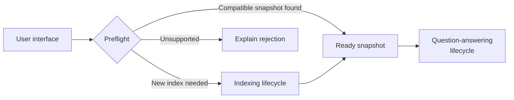
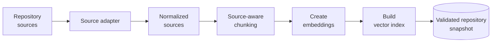
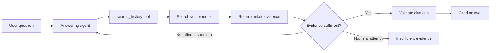

# RepoRationale — Architecture

**Status:** Approved for MVP  
**Last updated:** 2026-09-07

This document explains how RepoRationale is built: how repository history
becomes searchable evidence, how a user question becomes a cited answer, which
components own each stage, and which technologies implement those roles in the
MVP.

RepoRationale runs as a **modular monolith**. It is one application, but its UI,
application workflows, core logic, and external integrations remain separate
and testable.

## 1. Shape of the system

RepoRationale has two separate lifecycles:

1. The **indexing lifecycle** prepares a reusable, searchable snapshot of one
   repository.
2. The **question-answering lifecycle** uses a ready snapshot to retrieve
   evidence and answer rationale questions.

Preflight runs whenever a repository is selected and decides which path is
available:

**Preflight** is the decision gate before either snapshot reuse or indexing. It
first checks for a completed local snapshot compatible with the current source,
chunking, embedding, and index configuration. If none exists, it confirms
through the repository platform API that the selected public repository exists
and can be queried, then estimates the ingestion workload for its supported
history.

The estimate concerns the volume of data that would need to be collected,
chunked, embedded, and stored. It is compared with limits established by
benchmarks; it is not a promise of an exact duration or monetary cost.

Its outcomes are:

- **Ready:** a compatible snapshot from an earlier successful indexing run is
  available. The UI identifies that snapshot so the user can reuse it or
  request a manual rebuild.
- **Index required:** no compatible snapshot exists, but the repository can be
  indexed within the measured MVP limits. Indexing starts only after user
  confirmation.
- **Unsupported:** the reference is not a supported public repository, or its
  estimated ingestion workload exceeds the measured limits. The UI explains
  the reason and stops before paid embedding work begins.

Admission thresholds and runtime caps are centrally defined application policy
shared by preflight, snapshot building, and the rebuild command. Admission uses
cheap repository-size signals before collection; hard request and normalized-
source caps protect the actual build before publication. Their measured values
are implementation policy rather than architectural structure.

## 2. Indexing lifecycle

When preflight returns `Index required` and the user confirms, indexing runs
from repository collection through snapshot validation:

- **Repository sources:** the complete supported set of repository-native
  issues, completed pull requests and their conversation/review content, commit
  messages, and Markdown documentation.
- **Source adapter:** performs the platform-specific, paginated API calls and
  converts every independently citable item into the shared source-document
  form. After this stage, the rest of the system receives only normalized
  sources and does not need to understand the platform's API format.
- **Normalized sources:** are the adapter's output. They preserve stable
  identity, familiar platform type, text, original link, timestamps, state,
  and relationships.
- **Source-aware chunking:** divides long normalized sources into smaller
  searchable passages without losing their source identity or position.
  Markdown follows document structure, while repository conversations retain
  their natural source boundaries.
- **Create embeddings:** converts every chunk into a numeric representation used
  for semantic similarity search.
- **Build vector index:** stores the searchable chunk vectors together with the
  text and provenance required to return and cite the original evidence.
- **Validated repository snapshot:** is created only after required stages and
  counts have been verified. It contains the normalized corpus, derived chunks,
  vector index, and compatibility metadata as one reusable local result.

### Normalized source-document contract

`SourceDocument` is the platform-independent boundary returned by a repository
source adapter. It contains a platform-namespaced `source_id`, platform and
repository identifiers, an extensible platform-native `source_type`, non-empty
text, the original source URL, optional timezone-aware creation and update
timestamps, and optional title, item number, parent identity, and JSON metadata.

The model freezes its top-level fields, rejects unknown top-level fields,
requires parent identities to use the same platform namespace, and prevents
contradictory timestamp order. Provider SDK response objects never cross this
boundary.

The normalized source corpus is the canonical rebuild input; chunks, embeddings,
and the vector index are derived data. Indexing runs synchronously with
phase-level progress. Failed or interrupted builds are not queryable, while an
earlier ready snapshot remains reusable.

### Derived chunk contract

`SourceChunk` is the provider-independent retrieval unit derived from one
`SourceDocument`. Its stable ID combines the source ID with a zero-based
position. Every chunk repeats the source provenance needed by later retrieval
and citations, including platform, repository, source type, URL, timestamps,
parent relationship, title, item number, and source metadata. Markdown chunks
also retain their active heading hierarchy.

Markdown sources are split first by heading section and then by block boundary;
other source types keep their citation-addressable document as the natural
boundary and split long text at paragraph boundaries. An explicit character
limit bounds every chunk, with deterministic whitespace-aware fallback for an
oversized block. MVP indexing uses a product-wide maximum of 2,000 characters
with no overlap. This remains application configuration rather than an
end-user-selectable setting.

Derived chunks are stored deterministically beneath the validated normalized
snapshot as a separate `chunks/` artifact. Its manifest records the source and
chunk schema versions, chunker algorithm version and size parameter, source and
chunk digests, and chunk count. Publication validates the complete artifact
before atomically replacing only that derived directory. The parent
`manifest.json` and canonical `sources.jsonl` remain unchanged, and a complete
chunk artifact still does not mean that a searchable vector index is ready.

### Lexical retrieval baseline

The offline lexical baseline loads the same validated persisted chunks intended
for vector retrieval and builds a reusable in-memory BM25 representation. Its
small deterministic tokenizer case-folds Unicode letter and digit sequences,
treats punctuation and underscores as separators, and applies no stemming,
stop-word removal, metadata expansion, or query expansion. Results with no
lexical overlap are omitted rather than returned with arbitrary zero scores.

Both lexical and vector retrieval return the shared `RankedEvidence`
contract: a stable evidence ID matching the nested chunk ID, a one-based rank,
a finite raw score, and an extensible score-kind label. Raw scores retain their
retriever-specific meaning and are not probabilities or directly comparable
across retrieval methods. Equal BM25 scores are ordered by stable chunk ID, so
repeated searches remain deterministic.

### Vector retrieval product path

The product retrieval path embeds each persisted chunk with Voyage 4 using
document input semantics and stores the supplied vectors in a local persistent
Chroma collection configured for cosine distance. Query text is embedded
separately with query input semantics. Chroma never creates embeddings itself,
and its SDK types remain inside the embedding and vector-storage adapters.

The vector-index manifest anchors the collection to the exact normalized-source
and chunk digests, schema and algorithm versions, chunk-size parameter,
embedding model and dimension, Chroma version, distance metric, and record
count. Reuse requires both compatible metadata and validation of the persisted
collection. Corrupted artifacts fail explicitly rather than silently causing a
paid rebuild; missing or genuinely incompatible artifacts may be rebuilt from
the canonical chunks.

Index construction writes to a staged directory, validates the reopened Chroma
collection, and only then replaces the active vector artifact through the same
recoverable publication protocol used by the other snapshot artifacts. Chroma
records are inserted in batches no larger than the local client's reported
limit. A failed rebuild therefore leaves the previous completed index reusable,
and restarting the application can reopen a compatible index without embedding
the repository again.

The `search_history` application service accepts only non-blank query text and
returns at most five `RankedEvidence` results. Each result is mapped by stable
chunk ID back to the canonical persisted `SourceChunk`, rather than reconstructing
provenance from Chroma metadata. Its raw score is cosine distance, where smaller
values rank earlier; it is not a probability and is not numerically comparable
with a BM25 score. Similarity thresholds and evidence-sufficiency decisions
belong to the answering lifecycle rather than retrieval storage.

## 3. Question-answering lifecycle

Once a snapshot is ready, each question follows this workflow:

- **User question:** the natural-language rationale question entered in the UI.
- **Answering agent:** decides what to search and evaluates whether the returned
  evidence answers the actual question. It never explores the repository
  directly.
- **`search_history` tool:** the agent's only tool able to query repository
  history. It accepts a text query and requests a bounded search over every
  chunk in the active snapshot. It exposes no source, author, date, state, or
  repository-item filters.
- **Search vector index:** performs semantic similarity search for the current
  query.
- **Return ranked evidence:** supplies the most relevant chunks with source
  identity, direct link, and ranking information.
- **Evidence sufficient?:** the agent records a `sufficient` or `insufficient`
  assessment after each search. If information is missing and attempts remain,
  it may refine the query or follow a referenced repository item. It can search
  at most three times.
- **Validate citations:** deterministically rejects citation IDs that were not
  returned during the current run. It does not decide whether the explanation
  itself is persuasive.
- **Cited answer:** an `answered` result containing answer text and numbered
  citations tied to retrieved evidence.
- **Insufficient evidence:** an explicit abstention after the final unsuccessful
  search, rather than an unsupported guess.

Retrieval rank orders passages by relevance; it is not an AI confidence score.
The agent continues or stops according to whether the retrieved text supports
the requested rationale.

The application owns a provider-independent answering contract and a plain
Python workflow with a fixed limit of three searches. The answering provider
returns only one typed action at a time: request a search, provide a final
answer with selected evidence IDs, or report insufficient evidence. The first
action must be a search, every completed search receives an explicit
sufficiency assessment, and a fourth search request is rejected without being
executed.

The Anthropic adapter owns the Claude message history and translates the
standard tool-use and tool-result exchange into those application actions. It
accepts a maintainer-supplied model identifier and exposes a fixed set of
four tools: two query-only schemas covering the same bounded search,
`search_history` for the mandatory first call and `refine_search` for every
later one (whose own stated reason for refining is consequently a required
field rather than an optional one), and two non-retrieval tools,
`provide_answer` and `report_insufficient_evidence`, through which the model
must express its final answer or abstention as a schema-validated tool call
rather than free-form text. Every turn after the first forces the model to
call exactly one of the tools currently offered; extended thinking is
explicitly disabled so no supported model substitutes a `thinking` block for
that required call. Provider response objects and citation metadata never
cross the adapter boundary.

For an answered result, the workflow resolves numbered citations from the
accumulated evidence rather than trusting model-supplied titles, links, or
excerpts. It rejects unseen evidence IDs and requires the numeric markers in
the answer text to match the resolved citation numbers. Each successful run
also returns a compact in-memory trace containing search queries, returned
evidence IDs, sufficiency decisions, missing-information notes, call latency,
model usage, and the model and agent versions needed by later evaluation. Run
traces are not persisted at this stage.

### Evaluation artifact lifecycle

The offline evaluation foundation keeps semantic orchestration in the
application layer. It validates the versioned question set and cross-artifact
identity, computes retrieval and answering aggregates from raw case results,
renders the Markdown report, and rechecks both derived artifacts when a run is
loaded. The filesystem adapter only parses, serializes, and atomically
publishes the seven run files; it does not calculate metrics or depend on
application modules.

A completed local run contains a manifest, indexing measurements, separate
raw query-embedding usage, retrieval and answer JSON Lines records, a computed
summary, and a computed Markdown report. Known measurement gaps that cannot be
attached to an identifiable skipped item are recorded separately from skipped
items. Staged publication and reload validation prevent a partial write from
appearing complete. Semantic loading requires the corresponding reviewed
question set so split leakage, understated applicable query-request counts,
and tampered or mismatched summaries and reports are rejected.

A thin application runner converts outputs from the existing BM25,
Voyage/Chroma, and bounded-answering services into those raw per-case records.
It constructs no provider client and reads no credential; paid retrieval and
answering paths require an explicit caller confirmation, execute cases
sequentially, and perform no retry. Every run manifest selects exactly one
development or held-out split; aggregation, publication, loading, and the raw
runner reject results that cross that boundary so the held-out set is not
exposed during parameter tuning.

## 4. Architecture roles and MVP technologies

The lifecycles above define the technology-independent architecture. The MVP
implements each role with one concrete choice, including the exact Claude
model, selected through a bounded development comparison:

| Architecture role | MVP technology | Responsibility | Does not |
| --- | --- | --- | --- |
| Application runtime | [Python](https://www.python.org/) modular monolith | Runs the modules in one local process while preserving their boundaries | Create separate HTTP services or mix all responsibilities into the UI |
| User interface | [Streamlit](https://docs.streamlit.io/) | Selects a repository, presents preflight and indexing state, accepts questions, and renders results | Call repository, embedding, vector-store, or model APIs directly |
| Repository source adapter | [GitHub REST API](https://docs.github.com/en/rest) | Collects the complete supported GitHub corpus through explicit pagination and normalizes it | Expose raw GitHub responses to the core, use GraphQL, or support another platform in the MVP |
| Embedding provider | [Voyage 4](https://docs.voyageai.com/docs/embeddings) | Creates embeddings for indexed chunks and incoming search queries | Search the index, assess evidence, or generate answers |
| Vector storage and retrieval | [Chroma](https://docs.trychroma.com/) | Persists chunk vectors and returns ranked evidence for a query | Create embeddings, reason about evidence, or generate answers |
| Answering-model provider | [Anthropic Claude](https://platform.claude.com/docs/en/models/overview) through the [Anthropic Python SDK](https://github.com/anthropics/anthropic-sdk-python); MVP model is `claude-opus-5`, selected by a bounded development comparison | Chooses queries, calls `search_history`, assesses evidence sufficiency, and generates the cited answer | Access repository or storage systems directly, or cite evidence that retrieval did not return |
| Snapshot persistence | Local manifest and [JSON Lines](https://jsonlines.org/) source/chunk files, plus the Chroma index | Makes completed repository indexes reusable and rebuildable while keeping generated data local | Treat incomplete data as ready or store user credentials in the snapshot |
| Offline retrieval baseline | [BM25](https://en.wikipedia.org/wiki/Okapi_BM25) over the same chunks | Compares lexical retrieval with the product's semantic retrieval during evaluation | Participate in `search_history`, prefilter vector results, or create a second product retrieval path |

The UI calls application services rather than infrastructure providers. Small
adapters isolate the repository platform, embedding provider, answering-model
provider, and storage implementation, so each can be replaced later without
rewriting both lifecycles. The MVP implements only one option at each boundary
and searches one repository snapshot at a time.

Chunk size, retrieval result count, request concurrency, batching, retries,
repository admission limits, and the exact Claude model are selected from
measurements rather than exposed as user choices. The Claude model identifier
stays a configuration argument to the answering adapter, not a value the UI
lets a user choose; the provider-neutral application and domain contracts
described in section 3 do not depend on which Claude model is configured, so
a later Claude model can replace `claude-opus-5` without changing retrieval
or domain logic.

Current delivery state is maintained in [plan.md](plan.md).
