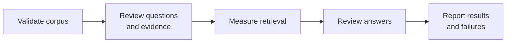

# RepoRationale — Evaluation

**Status:** Approved for MVP  
**Last updated:** 2026-09-07

This document explains how RepoRationale will be evaluated: what the system
must prove, how evidence and answers will be reviewed, which measurements will
be recorded, and how results will be reproduced. It combines the evaluation
method with the concise measured findings available at each completed stage.

## 1. What the evaluation must prove

Evaluation must establish that RepoRationale can:

1. build a complete, reusable index for a repository within the MVP limits;
2. retrieve evidence that a reviewer has already identified as relevant;
3. answer from that evidence without inventing undocumented rationale;
4. abstain when the available history is insufficient;
5. improve difficult searches through bounded query refinement; and
6. do this with visible latency, API usage, cost, and failure behaviour.

These concerns are measured separately so that one stage cannot conceal a
failure in another:

For example, a fluent answer does not count as successful when retrieval did
not return evidence that supports it.

## 2. Corpus and question set

### Selected corpus

The main external evaluation corpus is
[`google/gson`](https://github.com/google/gson). It was selected after
read-only measurements across recognizable repositories in several languages.
A suitable repository must:

- fit a measured, reviewed complete-corpus envelope;
- contain explicit rationale in the source types supported by the MVP;
- contain enough source variety to exercise normalization and citations;
- allow a reviewer to establish expected evidence without guessing intent; and
- be understandable and recognizable in a portfolio demonstration.

Gson is recognizable, has a varied supported history, and contains explicit
repository-native Markdown rationale, including `GsonDesignDocument.md`. Its
measured workload exceeds the conservative initial admission envelope, so its
first complete source build is an evaluation experiment with explicit
run-specific ceilings rather than evidence that the product defaults already
support it. `serilog/serilog` is the fallback if complete ingestion or
ground-truth review makes Gson impractical.

The other repositories retain only these supporting roles:

| Candidate | Evaluation role |
| --- | --- |
| [`Cross-PR Integration Risk Analyzer`](https://github.com/sophiatheofanidou/cross-pr-integration-risk-analyzer) | Author-owned companion repository for controlled dogfooding and development, with familiar Markdown decisions and commit history |
| [`serilog/serilog`](https://github.com/serilog/serilog) | Fallback main corpus if Gson proves impractical |
| [`microsoft/vscode`](https://github.com/microsoft/vscode) | Deliberately oversized preflight-rejection case |

[`Cross-PR Integration Risk Analyzer`](https://github.com/sophiatheofanidou/cross-pr-integration-risk-analyzer)
is an author-owned companion repository created by the same developer as
RepoRationale. It can support early development, dogfooding, and a small
controlled evaluation because its rationale is familiar and directly
reviewable. It cannot exercise the complete pull-request and issue corpus
expected from the main external evaluation repository, and it is not
independent evidence of performance on an unfamiliar repository. The oversized
case evaluates admission and rejection behaviour; it is not expected to become
an answer-quality corpus. Repositories are indexed and evaluated separately.

### Establishing reviewed questions

Each evaluation case is recorded before the system is run:

| Field | Purpose |
| --- | --- |
| Question | Natural-language input submitted to RepoRationale |
| Category | Capability or failure mode being exercised |
| Expected outcome | `answered` or `insufficient_evidence` |
| Expected sources | Stable source IDs and URLs that support an answer, when they exist |
| Review note | Why the evidence is sufficient, or how its absence was checked |

The question set will cover:

- exact identifiers, options, or component names;
- semantic “why” questions phrased differently from their evidence;
- answers that require multiple or superseding sources;
- ambiguous questions that benefit from a narrower follow-up search;
- answerable questions whose first retrieval is intentionally weak; and
- unanswerable questions with no verified documented rationale.

Keep the MVP evaluation lean: target 12 reviewed questions, with four
development cases and eight held-out cases. The exact composition is finalized
after corpus validation so every selected case has trustworthy ground truth.
A human reviewer must confirm that ground truth from the original repository
history; system-generated answers cannot establish their own expected
evidence.

The Gson question-set version 1 now contains that 4+8 split: three answerable
and one insufficient-evidence development case, plus six answerable and two
insufficient-evidence held-out cases. Codex reviewed every expected source
against the pinned normalized corpus. One draft case was corrected during that
review: it now asks why a Date-format change was proposed, because its source
explicitly says the proposal had not been accepted at the pinned revision. The
notes for two negative controls were also narrowed after independent corpus
search found related Gradle and asynchronous-history records that did not
support the controls' more specific premises. The held-out questions have not
been submitted to any retriever or answering model.

## 3. Retrieval evaluation

Retrieval is measured independently of answer generation. Vector retrieval and
the offline BM25 baseline run over the same persisted chunks, reviewed
questions, and result limit.

For each answerable question, the evaluation records a small set of metrics:

- **Hit@5**, the primary retrieval metric: whether at least one expected source
  is represented in the first five retrieved chunks;
- **MRR@5**, calculated automatically as a secondary metric: how early the
  first chunk from an expected source appears within the first five results;
- **source Recall@5**, only for questions that require multiple expected
  sources: the proportion of those sources represented in the first five
  chunks;
- retrieval latency; and
- failures grouped by question category and source type.

Relevance is judged at source level: a chunk counts as relevant when its source
ID is part of the reviewed expected evidence. Multiple chunks from the same
source must not inflate source-level recall.

The BM25 comparison diagnoses where semantic retrieval adds value and where
exact lexical matching is stronger. It does not create a second product
retrieval path or change the MVP architecture.

The retrieval-foundation tests use a tiny persisted corpus and hand-authored
vectors to verify the vector pipeline deterministically: expected evidence is
ranked first, provenance survives the Chroma round trip, the result count is
bounded, and a compatible index is reopened without repository re-embedding.
These are contract and persistence checks, not evidence that Voyage provides
good semantic retrieval on real repository history. That claim requires the
reviewed corpus, real Voyage embeddings, and retrieval metrics defined above.

### Gson development BM25 pilot

The offline BM25 baseline ran only the three answerable development questions
at the fixed top-five limit. It retrieved the direct design-document rationale
at rank one and missed both the semantic reword and the issue-comment case
chosen to exercise query refinement. The insufficient-evidence development
control was not retrieval-scored, and no held-out question was queried. This
1/3 Hit@5 result is a development diagnostic, not the final lexical score; it
establishes concrete misses for the Voyage comparison without changing their
ground truth after observation.

### Gson development Voyage/Chroma comparison

The pinned Gson snapshot produced 17,479 chunks at the selected 2,000-character
maximum. Building and validating its reusable Voyage 4/Chroma index required
137 document-embedding requests, accepted 2,965,021 tokens, and took about
248.3 seconds including index publication and validation. Reopening the
completed index took about 2.6 seconds and made no document-embedding request.
The vector index occupied 201,309,469 bytes; the source, chunk, and vector
artifacts occupied 243,836,197 bytes together.

At a recorded standard list price of `$0.06` per million tokens on 2026-09-07,
the document embeddings had a `$0.17790126` list-price equivalent. The three
first-search development queries and one separately labelled refinement
diagnostic used four query requests and 49 tokens, adding `$0.00000294`; the
combined Voyage list-price equivalent was `$0.17790420`. This is a cost
estimate, not a claim about whether the provider charged the account after any
free allowance.

The three answerable development cases were run once through each persisted
retrieval path at the fixed top-five limit. The insufficient-evidence control
was retained in the split's four-case count but was not retrieval-scored.

| Retriever | Hit@5 | MRR@5 | Mean latency |
| --- | ---: | ---: | ---: |
| BM25 | 1/3 | 0.333 | 0.070 s |
| Voyage/Chroma | 2/3 | 0.444 | 0.440 s |

Voyage preserved the design-document hit at rank one and recovered the
issue-comment rationale at rank three, which BM25 missed. Both retrievers
missed the semantic-reword case. The fixed refinement diagnostic did not bring
that case's predeclared exact source into the top five, so it remains a miss
rather than being re-labelled after observation. No held-out question and no
answering model was called in this run.

The run is scoped explicitly to the development split and reloads through the
semantic artifact validator with four split cases, six retrieval records, and
zero answer records. Its indexing record also discloses that blank-message
commits were excluded as non-rationale content but that their exact count and
identities cannot be reconstructed from the completed normalized snapshot.
This is a measurement limitation, not an assertion that no item was skipped.

### Development chunk-size calibration

Chunk size was calibrated offline against completed normalized
snapshots of [`pallets/itsdangerous`](https://github.com/pallets/itsdangerous)
at commit `672971d66a2ef9f85151e53283113f33d642dabd` and
[`pallets/markupsafe`](https://github.com/pallets/markupsafe) at commit
`b2e4d9c7687be25695fffbe93a37622302b24fb1`. The snapshots contained 1,659 and
2,148 independently citation-addressable sources respectively. No GitHub,
embedding, vector-store, or answering-model API was called.

The calibration had two deliberately separate stages:

1. The existing deterministic chunker was run in memory at 750, 1,000, 1,500,
   and 2,000 characters. This stage measured fragmentation and output volume;
   it did not measure retrieval quality. As an exploratory boundary diagnostic,
   up to 200 and 320 approximately 500-character windows around causal terms
   such as “because”, “reason”, and “instead” were checked for containment in a
   single chunk. These keyword-selected windows were not reviewed ground truth
   and included false positives such as logs or dependency text, so their
   percentages were used only to identify fragmentation risk. The
   750-character candidate was removed from the shortlist because it generated
   the most fragments and had the lowest window containment in both corpora.
2. Six real rationale cases, three per repository, were reviewed manually.
   Each case had a natural-language question, one known supporting source ID,
   and a specific passage that made the source sufficient. The same source
   documents were chunked at 1,000, 1,500, and 2,000 characters, indexed by the
   project's standard offline BM25 implementation, and searched with a fixed
   top-five limit. Hit@5 and MRR@5 used the known source ID; passage containment
   checked whether the complete reviewed passage remained in a single chunk.

The first-stage output counts were:

| Maximum characters | ItsDangerous chunks | MarkupSafe chunks | Combined |
| ---: | ---: | ---: | ---: |
| 750 | 3,498 | 5,081 | 8,579 |
| 1,000 | 3,082 | 4,421 | 7,503 |
| 1,500 | 2,636 | 3,679 | 6,315 |
| 2,000 | 2,346 | 3,230 | 5,576 |

The exploratory window-containment diagnostic was:

| Maximum characters | ItsDangerous windows | MarkupSafe windows |
| ---: | ---: | ---: |
| 750 | 60.0% | 57.8% |
| 1,000 | 75.5% | 72.2% |
| 1,500 | 84.5% | 79.1% |
| 2,000 | 91.0% | 90.0% |

These values mean only that a selected text window did or did not cross a
chunk boundary. They are not retrieval success rates and were not treated as
evidence that a chunk contained a correct answer.

The reviewed retrieval results were:

| Maximum characters | Hit@5 | MRR@5 | Passages kept in one chunk |
| ---: | ---: | ---: | ---: |
| 1,000 | 5/6 | 0.625 | 6/6 |
| 1,500 | 5/6 | 0.625 | 5/6 |
| 2,000 | 5/6 | 0.625 | 6/6 |

The same semantic-wording case failed at every size: BM25 returned related
records from the correct issue in the top five, but the exact decision-bearing
comment did not appear in the top 50 because the question and comment shared
too little vocabulary. This is a lexical-baseline limitation to test explicitly
with Voyage retrieval, not evidence for or against a chunk size.

The 2,000-character maximum was selected for MVP development. It tied the
1,000-character candidate on every reviewed retrieval and containment measure
while producing 1,927 fewer chunks, a 25.7% reduction. It also avoided the
1,500-character candidate's observed boundary failure, where a
1,502-character source became a 1,495-character chunk plus a six-character
remainder and the reviewed supporting passage crossed that boundary. Fewer
chunks also mean fewer embeddings and less opportunity for multiple fragments
of one source to occupy the fixed result set.

This was a small parameter-selection pilot, not the final held-out evaluation.
It did not measure Voyage retrieval, generated answers, citations, latency, or
API cost, and it does not support a general claim that 2,000 characters is
optimal for other repositories. Those questions remain part of the later
reviewed evaluation.

### Development Voyage/Chroma retrieval pilot

The selected 2,000-character artifacts were embedded through
the standard Voyage endpoint with `model="voyage-4"`, document input semantics,
no truncation, and the model's default 1,024 dimensions. The returned vectors
were stored in separate local Chroma indexes configured for cosine distance.
Each completed index passed full manifest, digest, record-count, dimension, and
persisted-collection validation, then reopened without another document
embedding call.

| Repository | Chunks/vectors | Document tokens | Build and validation |
| --- | ---: | ---: | ---: |
| ItsDangerous | 2,346 | 439,936 | 54.9 s |
| MarkupSafe | 3,230 | 698,938 | 75.1 s |
| **Combined** | **5,576** | **1,138,874** | **130.0 s** |

An initial attempt under Voyage's reduced no-payment-method limits failed with
a rate-limit response before publication. The atomic workflow left no vector
index or staging directory. After standard account limits were enabled, both
builds completed. The successful document run's list-price equivalent at
`$0.06` per million tokens was approximately `$0.068`; actual cost was `$0`
under the account's free token allowance. Tokens accepted during the failed
attempt were not returned by the interrupted adapter call and are therefore not
included in the successful-run count.

The same six pre-reviewed questions and exact expected source IDs used for the
BM25 chunk-size pilot were then run against both persisted retrieval paths with
a fixed top-five limit:

| Development case | Voyage rank | BM25 rank |
| --- | ---: | ---: |
| Remove the default SHA-512 fallback signer | — | 4 |
| Change the timestamp epoch from 2011 to 1970 | 1 | 1 |
| Aware-datetime compatibility risk | 2 | 1 |
| Remove the generic string-method wrapper | 4 | 1 |
| Reject an environment-variable speedup control | — | — |
| Do not publish wheels without speedups | — | 2 |
| **Hit@5** | **3/6** | **5/6** |
| **MRR@5** | **0.292** | **0.625** |

Voyage used 85 query tokens across the six calls. Mean end-to-end vector query
latency, including the remote query embedding and local Chroma search, was
343.2 ms. Loading the completed indexes made zero document-embedding calls.

Manual review of the misses preserved the predeclared exact-source metric
rather than changing ground truth after seeing results:

- for the fallback-signer question, Voyage returned the implementing pull
  request and commits, which identify what changed and link the issue but do
  not themselves document why it changed; the strict miss therefore remains;
- for the environment-variable question, Voyage returned generally related
  speedup discussions rather than the final decision-bearing comment; this is
  a substantive miss; and
- for the wheels question, Voyage returned a different comment that does
  support a rationale for requiring speedups. This exposes an incomplete
  expected-source set, but the original metric remains unchanged. Future
  reviewed question data must record every independently acceptable source
  before execution.

Two development-only query refinements then tested whether a second retrieval
could recover the two substantive misses. A refinement following the pull
request's reference to issue 155 retrieved the fallback-signer rationale at
rank 5. A terminology-focused refinement for the environment-variable decision
retrieved the correct issue description at rank 2 but still did not retrieve
the final decision comment. The two refinements used 38 query tokens and made
no document-embedding calls.

This small pilot shows that the persisted vector path operates correctly and
that a bounded second retrieval can recover useful missing evidence in at least
one real case. It does not show that Voyage outperforms the lexical baseline;
on this narrow exact-source set, BM25 was stronger. The cases were selected for
chunk calibration rather than as a representative held-out comparison, and no
generated answer, citation, abstention, or Claude model was evaluated.

## 4. Answer evaluation

Answer evaluation checks whether the agent chose the correct outcome and used
its bounded retrieval loop effectively.

### Development Claude-model comparison protocol

Before any live answer-generation call, the bounded model-selection comparison
is fixed as follows. It is a development experiment for selecting the MVP
answering model, not the final held-out evaluation. All models use the same
persisted Voyage 4 indexes, 2,000-character chunks, top-five retrieval limit,
answering workflow and prompt version, and three-search maximum.

| Case | Repository | Fixed question | Reviewed expectation |
| --- | --- | --- | --- |
| Direct retrieval | ItsDangerous | Why was the timestamp epoch changed from 2011 to 1970? | `answered`; the documented reason is compatibility with systems whose clocks can be earlier than 2011, supported by [the maintainer's historical explanation](https://github.com/pallets/itsdangerous/issues/204#issuecomment-770040669). |
| Recoverable miss | ItsDangerous | Why was the default SHA-512 fallback signer removed? | `answered`; if the first result set contains only the implementing pull request or commits, a useful refinement should recover [the rationale in issue 155](https://github.com/pallets/itsdangerous/issues/155). |
| Difficult miss | MarkupSafe | Why did MarkupSafe reject adding an environment variable to disable the C speedups? | `answered` only when the decision evidence is retrieved; [the final maintainer comment](https://github.com/pallets/markupsafe/issues/471#issuecomment-2422705831) explains the rationale. Safe abstention is preferable to an unsupported answer but remains an outcome miss for this answerable case. |
| Unanswerable control | MarkupSafe | Why did MarkupSafe switch its release automation from polling to webhooks? | `insufficient_evidence`; the reviewed development snapshot contains no documented decision matching this premise. |

The candidates are the current active Claude API tiers available for this
comparison: `claude-haiku-4-5-20251001`, `claude-sonnet-5`, and
`claude-opus-5`. At execution time their published standard prices were,
respectively, `$1/$5`, `$2/$10`, and `$5/$25` per million input/output tokens.
The exact identifiers, availability, and prices are rechecked immediately
before execution because provider offerings can change.

Each of the four cases runs once per model, for 12 agent runs. No failed or
unfavourable output is replaced by a more convenient retry. The application
limit permits at most three retrievals and therefore at most four Claude calls
per agent run: the complete comparison is capped at 48 Claude calls and 36
Voyage query embeddings. Runs execute sequentially. Before each new agent run,
the comparison stops if accumulated estimated Anthropic spend has reached
`$3.00`; no Batch API, prompt caching, fast mode, or provider-side tools are
used.

Every run records the structured outcome, searches and sufficiency assessments,
retrieved evidence IDs, citations, model-call and retrieval latencies, token
usage, estimated cost, and any provider or protocol error. Raw traces remain
private local artifacts; only the reviewed aggregate result is added here.

Selection first applies the hard requirements below. Among models without a
hard failure, the primary comparison is correct grounded outcome across the
four cases, including abstention on the control and no unsupported answer on
the difficult miss. Useful refinement, fewer unnecessary searches, and
claim-level citation support are reviewed explicitly. Cost is the first
tie-breaker and latency the second; this small run selects the model for this
project and does not establish that it is universally superior.

### Final Claude-model comparison result

The fixed 12-run comparison completed after the structural tool-calling
correction. Its raw traces remain private local artifacts and the aggregate
result is recorded here. All 12 planned agent runs completed — no run crashed
on a provider, credential, or network failure — using 36 total Anthropic calls
for an estimated total Anthropic cost of `$0.32678`, well under the `$3.00`
stop. No run's model attempted a `refine_search` call after its three-search
budget was exhausted and the tool was withheld, confirming the state-aware
exhausted-budget guidance.

| Model | Valid structured outcomes | Exact outcome/evidence match | Hard grounding failures | Anthropic calls | Mean wall-clock | Total cost |
| --- | ---: | ---: | ---: | ---: | ---: | ---: |
| Claude Haiku 4.5 | 4/4 | 3/4 | 0 | 12 | ~19.7 s | ~`$0.0351` |
| Claude Sonnet 5 | 2/4 | 1/4 (plus correct abstention on the control) | 2 | 13 | ~18.0 s | ~`$0.0994` |
| Claude Opus 5 | 4/4 | 4/4 | 0 | 11 | ~13.0 s | ~`$0.1922` |

Claude Sonnet 5's two hard grounding failures were both caught by existing
deterministic validators rather than silently accepted:

1. On the direct-retrieval case, its final answer text contained
   XML-like tool-format fragments and citation markers `[1]`, `[2]`, `[4]`,
   while its actual structured `citations` list contained only one entry.
   The citation-marker validator correctly rejected the mismatch.
2. On the difficult-miss case, it cited a real MarkupSafe evidence ID that
   its own retrieval had not returned during that run. The provenance
   validator correctly rejected the unknown citation.

The most plausible explanations for citing evidence the run did not retrieve
are inference from the surrounding retrieved context or an outright
fabricated-looking but coincidentally real ID; leaked pretraining knowledge
of the specific comment is one further possible explanation but is not
established by this run. The only established finding is that the cited
evidence ID was not among the results `search_history`/`refine_search`
returned during that run, which is exactly the condition the citation
validator exists to catch.

Claude Haiku 4.5's difficult-miss case did not fail: it retrieved and cited
a real, on-topic MarkupSafe maintainer comment supporting the same general
rationale (that the C speedups are not meant to be user-optional), but not
the specific predeclared decision comment for that case. This is recorded as
a non-exact evidence match, not a hallucination or grounding failure.

Claude Opus 5 matched the predeclared expected outcome and expected evidence
on all four cases, including retrieving and citing the intended
difficult-miss decision comment directly on its first search, and recovering
the recoverable-miss rationale from issue 155 through one `refine_search`
call.

Limitations of this result: it is one run per case per model across four
development cases selected for chunk and tool-contract calibration, not a
held-out or statistically powered evaluation; Claude API responses are
expected to vary run to run; the measured latency differences do not show
that Claude Opus 5 is generally faster than Claude Haiku 4.5 or Claude
Sonnet 5; and the broader held-out evaluation with a reviewed question set
remains the next stage of work. The selected model is recorded in the project
decision log.

### Gson development end-to-end answering pilot

The selected `claude-opus-5` model then ran once on each of the four Gson
development cases against the existing vector index. All cases completed
without retry or structural protocol failure. No held-out question was sent to
Voyage or Anthropic, and the index was reopened without document embedding.

| Measure | Result |
| --- | ---: |
| Correct binary outcome | 2/4 |
| Anthropic calls | 13 |
| Input/output tokens | 38,219 / 3,233 |
| Estimated Anthropic cost | `$0.271920` |
| Voyage query requests/tokens | 9 / 109 |
| Estimated Voyage query cost | `$0.00000654` |
| Mean end-to-end latency | 16.42 s |

The cost estimate uses the standard global Opus 5 price verified on
2026-09-07 (`$5` per million input tokens and `$25` per million output tokens).
The result was above the `$0.20–$0.25` central estimate but within its
conservative development range.

Qualitative review found three different failure modes:

- The direct checked-versus-unchecked-exception case exhausted three searches
  without retrieving the design-document section that the unchanged user
  question had ranked first in the earlier retrieval pilot. The model safely
  abstained, but the expected-evidence retrieval miss made the binary outcome
  incorrect and shows that its first query discarded useful wording.
- The semantic-reword subclassing case retrieved the expected design section
  on its first search and produced a supported cited answer.
- The adapter-precedence case reached the correct `answered` outcome and cited
  strong alternative evidence, but one historical explanation in the answer
  converted a source's explicitly speculative “maybe” into a factual claim.
  This is a substantive claim-support failure even though every citation ID
  was valid and returned during the run.
- The false Maven-to-Gradle premise was corrected using relevant retrieved
  evidence, but the model returned `answered` rather than the predeclared
  `insufficient_evidence` outcome. The answer itself was supported; the fixed
  version-1 ground truth remains unchanged, so this is still an outcome miss
  and exposes ambiguity that must be resolved in the binary-answer guidance
  before held-out controls are run.

This development run therefore validates the operational path but does not
justify proceeding directly to held-out evaluation. The next development
correction is prompt-level: preserve the user's distinguishing wording in the
mandatory first query, retain uncertainty qualifiers from evidence, and use
the existing `insufficient_evidence` outcome when the rationale premise itself
is unsupported or contradicted. These changes preserve the accepted four-tool,
three-search, two-outcome architecture and must be tested before any new paid
run.

### Hard agent requirements

These are pass/fail checks on every run:

- the agent makes no more than three `search_history` calls;
- every retrieval call has a recorded `sufficient` or `insufficient`
  assessment; and
- the final `answered` or `insufficient_evidence` outcome uses the defined
  structured result.

A failure here is treated as a defect, not compensated for by a high average
quality score.

### Reviewed quality measures

| Measure | What it checks |
| --- | --- |
| Outcome accuracy | `answered` or `insufficient_evidence` matches the reviewed expectation |
| Refinement usefulness | A later query recovers useful evidence absent from the first result set |
| Search efficiency | The system stops once evidence is sufficient instead of making unnecessary calls |

## 5. Grounding evaluation

Grounding evaluation checks whether every factual rationale claim is supported
by evidence the agent was actually given. A citation that is merely related to
the topic does not count as support.

The following are hard pass/fail requirements:

- every citation was returned during the current agent run;
- every citation resolves to stored provenance and an original source URL; and
- an answer never presents unsupported rationale as documented fact.

The reviewed grounding measures are:

| Measure | What it checks |
| --- | --- |
| Claim support | Evidence supports the specific rationale claim, not only the general topic |
| Citation completeness | Every material factual rationale claim has supporting evidence |

Claim support and citation completeness are reviewed by a person using a small,
documented rubric. An additional model-based judge is not required for the MVP.

## 6. Planned experiments

Only comparisons that validate a product claim, select an MVP parameter, or
expose a meaningful limitation belong in the evaluation:

| Experiment | Purpose |
| --- | --- |
| BM25 versus vector retrieval | Measure lexical and semantic retrieval on identical chunks and questions |
| One search versus bounded agent loop | Test whether a second or third search improves weak-first-search cases |
| Three-model Claude comparison (completed) | Select the MVP model using the same tool contract, evidence, questions, and answer format |
| End-to-end evaluation | Measure answers, abstentions, grounding, failures, latency, and cost together |

The Claude comparison considers tool-call correctness, outcome accuracy,
grounding, latency, and cost. It selects the most suitable model for this
project, not a universally best model.

The MVP does not require a large benchmark, an LLM judge, statistical analysis,
many values of K, or comparisons across many models. A direct general-agent
comparison, additional retrieval metrics, and deeper parameter experiments may
be added later if the core results expose a useful question. Hybrid production
retrieval, multiple embedding providers, vector-store benchmarks,
multi-repository search, and additional platforms remain outside the MVP.

## 7. System evaluation

System evaluation measures operational behaviour: whether indexing produces a
valid reusable snapshot, how long each stage takes, which external resources
are consumed, what they cost, and where failures occur. It reports latency,
API usage, cost, and failures as measurable results. Incomplete or silently
truncated ingestion must never produce a ready snapshot.

### Indexing measurements

For each repository and indexing run, record:

- wall-clock time for source collection and normalization, chunking,
  embeddings, index construction, and validation;
- repository-platform API calls and rate-limit consumption;
- embedding requests, input tokens or units, and estimated cost;
- source and chunk counts by type;
- snapshot size on disk; and
- skipped or failed items with their reasons.

### Ingestion performance

Authenticated builds used fixed public repository revisions so source identity,
corpus completeness, request use, and elapsed time could be compared without a
moving branch changing the input. These are development samples rather than the
final evaluation corpus.

| Repository revision | Issue/PR roots | Closed PRs | Commits | Tree entries | Sources |
| --- | ---: | ---: | ---: | ---: | ---: |
| `pallets/itsdangerous@672971d66a2ef9f85151e53283113f33d642dabd` | 433 | 307 | 677 | 60 | 1,659 |
| `pallets/markupsafe@b2e4d9c7687be25695fffbe93a37622302b24fb1` | 522 | 367 | 844 | 55 | 2,148 |

The `itsdangerous` comparison isolated two optimizations. Repository-wide
comment collections replaced requests made separately for every issue and pull
request. Bounded workers were then used only for per-pull-request review
summaries, for which GitHub provides no repository-wide REST collection.

| Collection strategy | Collection requests | Collection seconds | Workflow seconds | Requests including lookup |
| --- | ---: | ---: | ---: | ---: |
| Per-item comments, serial | 1,067 | 342.7 | 349.0 | 1,077 |
| Repository-wide comments, serial | 334 | 126.7 | 132.6 | 344 |
| Repository-wide comments, four review workers | 334 | 44.2 | 50.0 | 344 |

Repository-wide collections reduced requests by 68.7% and collection time by
63.0% without changing the 1,659 sources, per-type counts, corpus digest, or
unique identities. Four review workers then reduced the complete workflow by a
further 62.3% without adding requests.

The `markupsafe` comparison measured the bounded review-worker setting. Every
run used 400 collection requests and 411 requests including repository lookup,
and produced the same 2,148 sources and corpus digest.

| Review workers | Collection seconds | Workflow seconds | Normalized collection requests/minute |
| ---: | ---: | ---: | ---: |
| 4 | 57.1 | 63.5 | 420 |
| 8 | 37.3 | 43.3 | 643 |
| 16 | 31.5 | 38.2 | 761 |

Moving from four to eight workers reduced complete workflow time by 31.8%.
Doubling again to sixteen reduced it by only another 11.8% while increasing the
request burst. Eight workers therefore provide the selected balance between
latency and headroom below GitHub's independently enforced secondary rate
limits. The requests/minute values are throughput extrapolations from phase wall
time, not individual request latencies. No measured run received a rate-limit
response. See [GitHub REST API rate limits](https://docs.github.com/en/rest/using-the-rest-api/rate-limits-for-the-rest-api).

The resulting initial MVP envelope is 700 combined issue/pull-request roots,
500 closed pull requests, 1,100 commits, and 100 tree entries at admission,
followed by runtime caps of 3,000 normalized sources and 750 collection
requests. The runtime caps cover volume that cannot be estimated cheaply, such
as comments and reviews; the request cap is a total per-build budget rather
than a substitute for rate-limit handling.

The selected Gson experiment used explicit run-specific ceilings of 3,500
combined issue/pull-request roots, 1,500 closed pull requests, 2,500 commits,
500 tree entries, 15,000 normalized sources, and 2,000 collection requests. At
the pinned commit `b3f4ca20087f9066de4c340522ff84e0558e1ad1`, the successful
third attempt produced 13,893 sources in about 290 seconds using 1,406 GitHub
requests including repository lookup. Source collection accounted for 1,371
requests and about 262 seconds; the normalized snapshot occupied 19,248,406
bytes. Offline chunking at 2,000 characters produced 17,479 deterministic
chunks in about 2.5 seconds and a 23,278,322-byte chunk artifact.

The first two attempts failed late on one valid commit with a blank message;
neither published a snapshot. The adapter now treats blank commit messages as
non-rationale content, consistently with other empty discussion bodies. The
successful snapshot is complete for normalized non-blank sources, but its local
artifacts cannot reconstruct the exact number or identities of blank-message
commits skipped. The final indexing report must disclose that measurement gap;
it must not claim that no items were skipped. These measurements justify the
evaluation run but do not by themselves change the product's default limits.

Repeated builds and immediate reuse preserved stable unique identities and the
same corpus digest; failed or malformed collection never published a completed
snapshot. The two completed samples do not establish general production
capacity. Larger probes (`BurntSushi/ripgrep` at 2,967 roots and `psf/black` at
5,238) exceed the initial 700-root envelope and are intentionally unsupported
until new measurements justify changing it.

### Question-answering measurements

For each question and in aggregate by category, record:

- end-to-end response time;
- latency for each `search_history` call and the answering-model work;
- number of retrieval calls used, from one to three;
- answering-model input and output tokens;
- estimated cost per question;
- final outcome and whether it matched the expected outcome; and
- citation and claim-support review results.

Cost estimates record the provider price basis and date used, so later pricing
changes do not make an old report ambiguous.

### Failure analysis

Each unsuccessful case is assigned a primary failure stage:

- admission or indexing failure;
- expected evidence not retrieved;
- evidence retrieved but judged insufficient;
- answer produced when the system should have abstained;
- abstention despite sufficient retrieved evidence;
- unsupported claim or incomplete support;
- invalid or malformed citation;
- retrieval loop exhausted without resolution; or
- external API or provider failure.

Reports show counts and representative examples for each observed failure
type, rather than hiding them inside one aggregate success rate.

## 8. Results, reproducibility, and visuals

### When thresholds are fixed

Question categories, evaluation-record fields, hard correctness requirements,
and recorded operational measurements are fixed by this plan. Exact question
count, K, retrieval-quality targets, grounded-answer targets, and acceptable
latency or cost ceilings require a development pilot with real data.

Those numeric targets must be recorded before the held-out evaluation begins.
If a target changes after held-out results are seen, the change and its reason
must be documented and the complete experiment rerun.

### Reproducing a run

Every reported run records:

- repository and resolved commit;
- snapshot and schema versions;
- question-set version;
- chunking parameters and K;
- embedding and answering-model identifiers;
- prompt or agent version;
- relevant library versions;
- run date; and
- the documented command used to run the experiment.

Small evaluation inputs and aggregate results may be committed. Credentials,
generated repository snapshots, full indexes, and other private local data are
not committed.

The reviewed questions and expected evidence will be stored as a small
versioned evaluation input. One evaluation command will run the cases,
calculate the retrieval metrics, collect timings and usage, and generate a
readable local report. Detailed traces and model outputs remain under
private local storage; aggregate findings are added to this document so they
can be reviewed without reading raw files.

The offline artifact foundation now validates the question-set and run schemas,
computes aggregates only from raw case records, and publishes seven local files
atomically: `run-manifest.json`, `indexing.json`, `query-usage.json`,
`retrieval-results.jsonl`, `answer-results.jsonl`, `summary.json`, and
`report.md`. Query embeddings remain separate from document-embedding
measurements, and unquantifiable measurement gaps remain separate from
identified skipped items. Each manifest selects one development or held-out
split. Loading a run with its reviewed question set recomputes the summary and
report and rejects split leakage, cross-artifact disagreement, and applicable
query-request totals that are lower than the raw vector results imply. Live
workflow integration has a thin raw-result runner with explicit paid-mode
gates; the retained private Gson runner can validate and republish offline,
reuse a compatible index, and refuses a new paid build or query without its
specific confirmation flag.

### Visual evidence to add later

No evaluation visual has been added yet. The recorded numeric results above
remain the source for later generated charts. The most useful visuals will be:

| Visual | What it demonstrates |
| --- | --- |
| Cited-answer screenshot | What an evidence-grounded answer looks like in the UI |
| Insufficient-evidence screenshot | How explicit abstention is presented |
| Real refinement trace | How a second or third search changes the retrieved evidence |
| Retrieval comparison chart | BM25 and vector performance by question category |
| Indexing-duration chart | Where indexing time is spent |
| Failure-count chart | Which stages account for unsuccessful cases |

Charts are generated from recorded evaluation results rather than assembled by
hand. Screenshots illustrate product behaviour but do not replace measurable
results.

For the product boundaries, architecture, and rationale behind accepted
choices, see the other documents in this directory.
