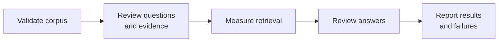

# RepoRationale — Evaluation

**Status:** Approved for MVP  
**Last updated:** 2026-09-03

This document explains how RepoRationale will be evaluated: what the system
must prove, how evidence and answers will be reviewed, which measurements will
be recorded, and how results will be reproduced. It defines the evaluation
method before results exist; measured findings will be added during later
milestones.

## 1. What the evaluation must prove

Evaluation must establish that RepoRationale can:

1. build a complete, reusable index for a repository within the MVP limits;
2. retrieve evidence that a reviewer has already identified as relevant;
3. answer from that evidence without inventing undocumented rationale;
4. abstain when the available history is insufficient;
5. improve difficult searches through bounded query refinement; and
6. do this with visible latency, API usage, cost, and failure behaviour.

These concerns are measured separately so that one stage cannot conceal a
failure in another:

For example, a fluent answer does not count as successful when retrieval did
not return evidence that supports it.

## 2. Corpus and question set

### Selecting a corpus

The final evaluation corpus will be selected after the real ingestion pipeline
can measure the shortlisted repositories. A suitable repository must:

- pass preflight and fit the tested complete-corpus limits;
- contain explicit rationale in the source types supported by the MVP;
- contain enough source variety to exercise normalization and citations;
- allow a reviewer to establish expected evidence without guessing intent; and
- be understandable and recognizable in a portfolio demonstration.

The provisional candidates serve different purposes:

| Candidate | Evaluation role |
| --- | --- |
| CrossPR Risk Analyzer | Controlled development corpus with familiar Markdown decisions and commit history |
| [`psf/black`](https://github.com/psf/black) | Leading smaller main-corpus candidate |
| [`BurntSushi/ripgrep`](https://github.com/BurntSushi/ripgrep) | Smaller-to-moderate non-Python alternative |
| [`pydantic/pydantic`](https://github.com/pydantic/pydantic) | Larger ingestion and retrieval stress candidate |
| [`prettier/prettier`](https://github.com/prettier/prettier) | Larger non-Python stress candidate |
| [`microsoft/vscode`](https://github.com/microsoft/vscode) | Deliberately oversized preflight-rejection case |

CrossPR can support early development and a small controlled evaluation, but it
cannot exercise the complete pull-request and issue corpus expected from the
main external evaluation repository. The oversized case evaluates admission
and rejection behaviour; it is not expected to become an answer-quality
corpus. Repositories are indexed and evaluated separately.

### Establishing reviewed questions

Each evaluation case is recorded before the system is run:

| Field | Purpose |
| --- | --- |
| Question | Natural-language input submitted to RepoRationale |
| Category | Capability or failure mode being exercised |
| Expected outcome | `answered` or `insufficient_evidence` |
| Expected sources | Stable source IDs and URLs that support an answer, when they exist |
| Review note | Why the evidence is sufficient, or how its absence was checked |

The question set will cover:

- exact identifiers, options, or component names;
- semantic “why” questions phrased differently from their evidence;
- answers that require multiple or superseding sources;
- ambiguous questions that benefit from a narrower follow-up search;
- answerable questions whose first retrieval is intentionally weak; and
- unanswerable questions with no verified documented rationale.

Keep the MVP evaluation lean: use approximately 10–15 reviewed questions in
total, with a small development subset and questions not used for tuning. The
exact composition is finalized after corpus validation so every selected case
has trustworthy ground truth. A human reviewer must confirm that ground truth
from the original repository history; system-generated answers cannot
establish their own expected evidence.

## 3. Retrieval evaluation

Retrieval is measured independently of answer generation. Vector retrieval and
the offline BM25 baseline run over the same persisted chunks, reviewed
questions, and result limit.

For each answerable question, the evaluation records a small set of metrics:

- **Hit@5**, the primary retrieval metric: whether at least one expected source
  is represented in the first five retrieved chunks;
- **MRR@5**, calculated automatically as a secondary metric: how early the
  first chunk from an expected source appears within the first five results;
- **source Recall@5**, only for questions that require multiple expected
  sources: the proportion of those sources represented in the first five
  chunks;
- retrieval latency; and
- failures grouped by question category and source type.

Relevance is judged at source level: a chunk counts as relevant when its source
ID is part of the reviewed expected evidence. Multiple chunks from the same
source must not inflate source-level recall.

The BM25 comparison diagnoses where semantic retrieval adds value and where
exact lexical matching is stronger. It does not create a second product
retrieval path or change the MVP architecture.

## 4. Answer evaluation

Answer evaluation checks whether the agent chose the correct outcome and used
its bounded retrieval loop effectively.

### Hard agent requirements

These are pass/fail checks on every run:

- the agent makes no more than three `search_history` calls;
- every retrieval call has a recorded `sufficient` or `insufficient`
  assessment; and
- the final `answered` or `insufficient_evidence` outcome uses the defined
  structured result.

A failure here is treated as a defect, not compensated for by a high average
quality score.

### Reviewed quality measures

| Measure | What it checks |
| --- | --- |
| Outcome accuracy | `answered` or `insufficient_evidence` matches the reviewed expectation |
| Refinement usefulness | A later query recovers useful evidence absent from the first result set |
| Search efficiency | The system stops once evidence is sufficient instead of making unnecessary calls |

## 5. Grounding evaluation

Grounding evaluation checks whether every factual rationale claim is supported
by evidence the agent was actually given. A citation that is merely related to
the topic does not count as support.

The following are hard pass/fail requirements:

- every citation was returned during the current agent run;
- every citation resolves to stored provenance and an original source URL; and
- an answer never presents unsupported rationale as documented fact.

The reviewed grounding measures are:

| Measure | What it checks |
| --- | --- |
| Claim support | Evidence supports the specific rationale claim, not only the general topic |
| Citation completeness | Every material factual rationale claim has supporting evidence |

Claim support and citation completeness are reviewed by a person using a small,
documented rubric. An additional model-based judge is not required for the MVP.

## 6. Planned experiments

Only comparisons that validate a product claim, select an MVP parameter, or
expose a meaningful limitation belong in the evaluation:

| Experiment | Purpose |
| --- | --- |
| BM25 versus vector retrieval | Measure lexical and semantic retrieval on identical chunks and questions |
| One search versus bounded agent loop | Test whether a second or third search improves weak-first-search cases |
| Two-model Claude comparison | Select the MVP model using the same tool contract, evidence, questions, and answer format |
| End-to-end evaluation | Measure answers, abstentions, grounding, failures, latency, and cost together |

The Claude comparison considers tool-call correctness, outcome accuracy,
grounding, latency, and cost. It selects the most suitable model for this
project, not a universally best model.

The MVP does not require a large benchmark, an LLM judge, statistical analysis,
many values of K, or comparisons across many models. A direct general-agent
comparison, additional retrieval metrics, and deeper parameter experiments may
be added later if the core results expose a useful question. Hybrid production
retrieval, multiple embedding providers, vector-store benchmarks,
multi-repository search, and additional platforms remain outside the MVP.

## 7. System evaluation

System evaluation measures operational behaviour: whether indexing produces a
valid reusable snapshot, how long each stage takes, which external resources
are consumed, what they cost, and where failures occur. It reports latency,
API usage, cost, and failures as measurable results. Incomplete or silently
truncated ingestion must never produce a ready snapshot.

### Indexing measurements

For each repository and indexing run, record:

- wall-clock time for source collection and normalization, chunking,
  embeddings, index construction, and validation;
- repository-platform API calls and rate-limit consumption;
- embedding requests, input tokens or units, and estimated cost;
- source and chunk counts by type;
- snapshot size on disk; and
- skipped or failed items with their reasons.

### Question-answering measurements

For each question and in aggregate by category, record:

- end-to-end response time;
- latency for each `search_history` call and the answering-model work;
- number of retrieval calls used, from one to three;
- answering-model input and output tokens;
- estimated cost per question;
- final outcome and whether it matched the expected outcome; and
- citation and claim-support review results.

Cost estimates record the provider price basis and date used, so later pricing
changes do not make an old report ambiguous.

### Failure analysis

Each unsuccessful case is assigned a primary failure stage:

- admission or indexing failure;
- expected evidence not retrieved;
- evidence retrieved but judged insufficient;
- answer produced when the system should have abstained;
- abstention despite sufficient retrieved evidence;
- unsupported claim or incomplete support;
- invalid or malformed citation;
- retrieval loop exhausted without resolution; or
- external API or provider failure.

Reports show counts and representative examples for each observed failure
type, rather than hiding them inside one aggregate success rate.

## 8. Results, reproducibility, and visuals

### When thresholds are fixed

Question categories, evaluation-record fields, hard correctness requirements,
and recorded operational measurements are fixed by this plan. Exact question
count, K, retrieval-quality targets, grounded-answer targets, and acceptable
latency or cost ceilings require a development pilot with real data.

Those numeric targets must be recorded before the held-out evaluation begins.
If a target changes after held-out results are seen, the change and its reason
must be documented and the complete experiment rerun.

### Reproducing a run

Every reported run records:

- repository and resolved commit;
- snapshot and schema versions;
- question-set version;
- chunking parameters and K;
- embedding and answering-model identifiers;
- prompt or agent version;
- relevant library versions;
- run date; and
- the documented command used to run the experiment.

Small evaluation inputs and aggregate results may be committed. Credentials,
generated repository snapshots, full indexes, and other private local data are
not committed.

The reviewed questions and expected evidence will be stored as a small
versioned evaluation input. One evaluation command will run the cases,
calculate the retrieval metrics, collect timings and usage, and generate a
readable local report. Detailed traces and model outputs remain under
`.local/evaluation-runs/`; aggregate findings are added to this document so
they can be reviewed without reading raw files.

### Visual evidence to add later

No screenshots, charts, or results exist yet. Once the system is implemented,
the most useful visuals will be:

| Visual | What it demonstrates |
| --- | --- |
| Cited-answer screenshot | What an evidence-grounded answer looks like in the UI |
| Insufficient-evidence screenshot | How explicit abstention is presented |
| Real refinement trace | How a second or third search changes the retrieved evidence |
| Retrieval comparison chart | BM25 and vector performance by question category |
| Indexing-duration chart | Where indexing time is spent |
| Failure-count chart | Which stages account for unsuccessful cases |

Charts are generated from recorded evaluation results rather than assembled by
hand. Screenshots illustrate product behaviour but do not replace measurable
results.

For the product boundaries, architecture, and rationale behind accepted
choices, see the other documents in this directory.
