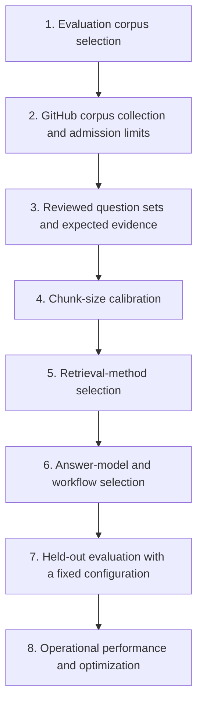

# RepoRationale: Evaluation

RepoRationale was evaluated as an evidence workflow: can it recover relevant
repository history, answer from that history with traceable citations, and say
when the available evidence is insufficient?

The evaluation was not one final benchmark performed after implementation. It
developed with the product. Smaller repositories were used to test ingestion,
chunking, retrieval, and model behaviour; the result of each stage fixed a
choice for the next one. Only then was a held-out question set run against a
larger external repository.

This document follows that sequence. Each stage states its goal, why the
measurement was needed, what was observed, and which decision followed. Product
scope belongs in the [project definition](project.md), while component
responsibilities and runtime contracts belong in the
[architecture](architecture.md). They are not repeated here.

Three kinds of verification were used. Automated software tests checked that
the implementation and evaluation machinery behaved consistently. Recorded
experiments measured alternatives such as chunk sizes, retrievers, models, and
concurrency settings. Manual review established whether historical evidence
and generated claims were actually relevant. The evaluation therefore did not
treat every step as the same kind of “test.”

## 1. Evaluation corpus selection

**Goal.** Find a main external repository with a corpus large enough and varied
enough to represent the setting RepoRationale is intended to address, while
using smaller repositories for earlier development decisions. “Large enough”
meant thousands of historical items across a long-lived project, sufficient to
exercise pagination, request limits, indexing cost, and evidence ranking.
“Varied enough” meant that rationale appeared across different source types,
including issues, pull requests, comments, commits, and documentation, and
allowed evaluation of direct questions, semantic rewordings, and
unsupported-premise controls.

**Why it was needed.** RepoRationale is intended to be most useful when a
repository has accumulated enough history that repeatedly locating past
decisions becomes costly and the relevant explanation may be old or distributed
across several source types. For a small repository with limited history,
direct Git inspection or a general coding agent may be simpler and equally
effective. A final evaluation based only on a small or familiar repository
would therefore avoid the setting in which a reusable evidence index is meant
to provide value. Smaller familiar repositories were still useful earlier for
checking known history and making controlled development decisions.

**Repositories used.** [Gson](https://github.com/google/gson) is Google's
open-source Java library for converting Java objects to and from JSON. It became
the main external corpus because it has a large, varied public history and
explicit rationale sources such as `GsonDesignDocument.md`. It was not the only
repository evaluated.

| Repository | Role | What it helped measure |
| --- | --- | --- |
| [Cross-PR Integration Risk Analyzer](https://github.com/sophiatheofanidou/cross-pr-integration-risk-analyzer) | Familiar reference corpus | Early checks against a user-owned repository whose history was already known; it contains no pull requests and was not a final evaluation candidate |
| [ItsDangerous](https://github.com/pallets/itsdangerous) | Development corpus: 1,659 sources | Ingestion requests, chunking, retrieval, refinement, and model comparison |
| [MarkupSafe](https://github.com/pallets/markupsafe) | Development corpus: 2,148 sources | Collection concurrency, difficult retrieval, abstention, and model comparison |
| [Gson](https://github.com/google/gson) | Main external corpus: 13,893 sources in the held-out run | Limits, final questions, answer quality, latency, and cost |
| [ripgrep](https://github.com/BurntSushi/ripgrep) and [Black](https://github.com/psf/black) | Size probes: 2,967 and 5,238 roots | Showed that the original 700-root limit was too restrictive |
| [VS Code](https://github.com/microsoft/vscode) | Oversized candidate | Tested preflight rejection, not answer quality |

**Results.** The familiar repository supported early correctness checks;
ItsDangerous and MarkupSafe supplied manageable development corpora; ripgrep
and Black showed that the first size limit excluded useful repositories; Gson
combined scale, source variety, and manually reviewable rationale; and VS Code
provided a repository clearly beyond the intended release envelope.

**Decision.** Use several repositories for development decisions and reserve
Gson for the main external held-out evaluation. Repository size was not treated
as a proxy for evaluation quality: the choice also required varied historical
sources and questions whose expected evidence could be reviewed manually.

## 2. GitHub corpus collection and admission limits

**Goal.** Determine how to collect the selected repositories completely within
acceptable GitHub request and wall-clock costs, and establish when a repository
must be rejected before indexing begins.

**Why it was needed.** Later retrieval measurements are meaningful only if the
underlying corpus is complete. The initial implementation made too many
per-item requests, while the initial 700-root ceiling rejected repositories
that were still feasible to process. Collection strategy and admission limits
therefore needed their own measurements, separate from corpus selection.

**Results.** The development runs measured endpoint choice, worker count, and
the larger Gson envelope.

| Measurement | Earlier result | Improved result |
| --- | ---: | ---: |
| ItsDangerous comment collection | 1,067 per-item requests | 334 repository-wide requests |
| ItsDangerous complete workflow | 349.0 s serial | 50.0 s with repository-wide comments and 4 review workers |
| MarkupSafe complete workflow | 63.5 s with 4 workers | 43.3 s with 8; 38.2 s with 16 |
| Gson complete source build | Rejected by the original limits | 13,893 sources in about 290 s and 1,406 GitHub requests |

**Decision.** Repository-wide collection was used where GitHub supported it,
and eight workers were selected for per-pull-request review collection: most of
the measured gain without taking the additional rate-limit risk of sixteen.
The supported ceilings were expanded to the measured Gson envelope: 3,500
issue/pull-request roots, 1,500 closed pull requests, 2,500 commits, 500 tree
entries, 15,000 normalized sources, and 2,000 GitHub collection requests.
Repositories beyond any ceiling are rejected rather than indexed partially.

## 3. Reviewed question sets and expected evidence

**Goal.** Define expected outcomes and evidence independently of the generated
answers, and keep a final set unseen while the workflow was being tuned.

**Why it was needed.** An answer model cannot grade its own historical claims.
A fluent response may cite a related source without recovering the documented
reason the reviewer expected. Development questions were also needed to reveal
workflow defects without contaminating the final result.

**How it was done.** This was not a unit test that could discover historical
truth automatically. The reviewer first inspected repository history and saved
each question, its expected `answered` or `insufficient_evidence` outcome, the
supporting source IDs and URLs, and an explanation of why that evidence was
sufficient. Evaluation runners then executed retrieval or answering against
those saved cases and calculated the metrics. Automated tests checked the
runner, metric calculations, result structure, and separation of question
sets; manual review established historical relevance and answer support.

“Development questions” were visible while choices were being improved. The
“held-out questions” were set aside and not used for tuning; they were executed
once only after the evaluated configuration and success targets had been fixed.

| Question set | Repository | Cases | Purpose |
| --- | --- | ---: | --- |
| Chunk calibration | ItsDangerous and MarkupSafe | 6 answerable | Compare chunk sizes using known decision-bearing passages |
| Claude model comparison | ItsDangerous and MarkupSafe | 4 per model | Direct retrieval, a recoverable miss, a difficult miss, and an unanswerable control |
| Gson development questions | Gson | 4 | Identify retrieval and prompting defects before the final protocol |
| Gson held-out questions | Gson | 8 | Final one-shot run: 6 answerable questions and 2 unsupported-premise controls |

**Results.** Manual review corrected one candidate question that confused a
proposal with an accepted change. The held-out questions remained unseen until
the workflow, model, expected sources, and success targets had been fixed.

**Decision.** Use the development sets to choose and correct the system, then
lock the eight Gson held-out questions, their expected evidence, and the success
targets before the final run. Results from that run would be reported without
retry. Later diagnostics could explain a miss or test a subsequent improvement,
but could not replace the published held-out result.

## 4. Chunk-size calibration

**Goal.** Choose a chunk size that preserved decision-bearing passages while
avoiding unnecessary embedding and storage work.

**Why it was needed.** Small chunks can separate a decision from its rationale;
large chunks can dilute retrieval and increase model context. The choice needed
evidence rather than an arbitrary default.

### How the retrieval metrics were chosen

The application retrieves at most five chunks per search, so evaluation uses
the same top-five boundary. This makes the measurements reflect the evidence
actually available to the answering workflow rather than an arbitrarily long
ranking that the model never sees.

| Measure | Why it was selected | How to read it |
| --- | --- | --- |
| Hit@5 | Tests the minimum retrieval requirement: did at least one pre-reviewed expected source reach the five chunks available to the answering workflow? | `5/6` means success on five of six questions, or 83.3%; the remaining question was a miss. |
| MRR@5 | Distinguishes an expected source ranked near the top from one barely reaching fifth place, even when both count as hits. | Each question contributes `1 ÷ rank` for its first expected source, or 0 for a miss, and those values are averaged. The result ranges from 0 to 1 and is a ranking score, not a percentage. |
| Passage containment | Checks whether the complete reviewed rationale remains together after chunking. | `6/6` means every reviewed passage fit within one chunk. |
| Chunk count | Represents embedding, storage, and ranking work when quality measures tie. | Lower is preferable only when retrieval and passage preservation do not worsen. |

Source Recall@5 was also recorded for questions that required several expected
sources. It asks how many of those sources appeared in the top five, without
letting several chunks from one source inflate the result. It was a case-level
diagnostic rather than a deciding aggregate in the comparisons below, so it is
not presented as a headline score.

**Results.** Six reviewed questions were run against the same content at three
maximum sizes. A 750-character candidate had already been dropped because it
created the most fragments.

| Maximum characters | Combined chunks | Hit@5 | MRR@5 | Reviewed passages kept together |
| ---: | ---: | ---: | ---: | ---: |
| 1,000 | 7,503 | 5/6 | 0.625 | 6/6 |
| 1,500 | 6,315 | 5/6 | 0.625 | 5/6 |
| **2,000** | **5,576** | **5/6** | **0.625** | **6/6** |

Here, Hit@5 of 5/6 and MRR@5 of 0.625 were not treated as an absolute grade of
“good.” They showed that all three chunk sizes produced the same retrieval
outcome: five questions found their expected source and one did not, with the
same ranking score. Because retrieval could not distinguish the candidates,
passage containment and chunk count determined the choice.

**Decision.** The 2,000-character setting tied the best retrieval result,
preserved all six reviewed passages, and produced 1,927 fewer chunks than the
1,000-character setting. It was selected as the best measured trade-off for
this corpus set, not as a universal optimum.

## 5. Retrieval-method selection

**Goal.** Determine whether the product path should use lexical BM25 retrieval
or Voyage embeddings stored and searched through Chroma.

**Why it was needed.** Semantic retrieval adds embedding time, cost, and an
external provider. It needed to recover evidence that a cheaper keyword
baseline missed. Both methods therefore used the same chunks, questions, and
five-result limit.

**Results.** The comparison was mixed across stages.

| Evaluation stage | BM25 | Voyage/Chroma | Plain-language result |
| --- | ---: | ---: | --- |
| Initial six-question comparison | Hit@5 5/6; MRR@5 0.625 | Hit@5 3/6; MRR@5 0.292 | BM25 found the expected source for two more questions and usually ranked it earlier. |
| Gson development questions | Hit@5 1/3; MRR@5 0.333 | Hit@5 2/3; MRR@5 0.444 | Vector retrieval found one additional expected source, but three questions were too few for a strong conclusion. |
| Gson held-out questions | Hit@5 4/6; MRR@5 0.444 | **Hit@5 6/6; MRR@5 0.833** | Vector retrieval found expected evidence for all six questions and generally placed it near the top; BM25 missed two. |

Mean search latency was 0.078 seconds for BM25 and 0.353 seconds for vector
retrieval. BM25 won the initial exact-source comparison; vector search recovered
an issue-comment rationale missed by BM25 in development and both BM25 misses
in the final set.

The strongest result was therefore not “MRR@5 is 83.3%.” It was that vector
retrieval passed the predeclared Hit@5 target of at least 4/6 with 6/6, beat the
BM25 baseline on the same held-out questions, and achieved an MRR@5 close to the
maximum of 1. The earlier comparisons remain useful counter-evidence: vector
retrieval did not win on every question set.

**Decision.** Vector retrieval became the product path because it retrieved the
expected evidence for all six answerable held-out questions. BM25 remained the
evaluation baseline. This supports the choice on the reviewed corpora; it does
not establish that semantic search is always superior.

## 6. Answer-model and workflow selection

**Goal.** Select an answering model that followed the evidence and citation
contract, then correct observable workflow failures before the held-out run.

**Why it was needed.** Retrieval success does not guarantee a grounded answer.
The model must choose the right outcome, cite only retrieved evidence, and
request another search only when needed. Invalid citations were treated as hard
failures; claim support and citation completeness were reviewed separately.

**Results.** Three Claude models answered the same four development cases from
ItsDangerous and MarkupSafe against the same indexes and three-search budget.

| Model | Valid outcomes | Exact outcome/evidence match | Hard grounding failures | Mean time | Cost |
| --- | ---: | ---: | ---: | ---: | ---: |
| Claude Haiku 4.5 | 4/4 | 3/4 | 0 | ~19.7 s | ~$0.035 |
| Claude Sonnet 5 | 2/4 | 1/4 | 2 | ~18.0 s | ~$0.099 |
| **Claude Opus 5** | **4/4** | **4/4** | **0** | **~13.0 s** | **~$0.192** |

After Opus was selected, a separate four-question Gson development run achieved
only 2/4 correct outcomes. It exposed three problems: the initial query could
lose useful user wording, the answer could overstate uncertainty, and false
premises were not handled reliably.

**Decision.** Opus was selected because it was the only tested model with four
exact matches and no grounding failure. The prompt was corrected to preserve
the user's distinguishing wording, retain uncertainty qualifiers, and use the
abstention outcome when the rationale premise was unsupported. The bounded
refinement workflow was then fixed for held-out evaluation. Sonnet's two
invalid outputs remained recorded as rejected results rather than being counted
as answers.

## 7. Held-out evaluation with a fixed configuration

**Goal.** Test six answerable Gson questions and two unsupported-premise
controls once, without changing the evaluated configuration after seeing their
results. Here, “fixed configuration” means the selected chunk size, retriever,
answer model, prompt and search workflow, success targets, questions, and
expected evidence.

**Why it was needed.** Development scores describe iteration, not
generalization. The held-out run needed to show both positive behaviour
(finding and explaining rationale) and negative behaviour (abstaining when
related history did not support the question's premise).

**Results.** The system chose the correct `answered` or
`insufficient_evidence` outcome in all eight cases, with no malformed or
unauthorized citation. Manual review found adequate claim support and citation
completeness in all eight. Five of the six answerable responses cited a
predeclared expected source.

The remaining answer was grounded but incomplete relative to the preferred
rationale. Direct vector search contained that source, but the answering
workflow's paraphrased query did not retrieve it. The alternative citations
supported what the answer said, yet omitted part of what the reviewed evidence
could have established. The stricter result therefore remained 5/6.

The unsupported-premise controls matter because related search results can make
a false premise sound credible. For example, Gson's history contains
logging-related items, but no evidence that Gson uses SLF4J internally or chose
it over `java.util.logging`. The correct outcome for that control was therefore
`insufficient_evidence`.

**Decision.** The held-out targets were accepted as met, while the 5/6
expected-source result remained a visible limitation. No held-out question was
retried for the published score.

### Post-run diagnostics

Diagnostics did not change that decision or the published held-out results.

- Re-running the incomplete case with the exact question first recovered the
  preferred source in one search. Latency fell from 25.22 to 9.16 seconds and
  answer cost from $0.099770 to $0.030545. This led to adoption of the
  exact-question-first rule after the held-out evaluation.
- A separate conversational diagnostic used prior-turn context to resolve an
  ambiguous follow-up, found the relevant evidence in two searches, and
  produced no invalid citations. This supported bounded session context rather
  than persistent memory.

## 8. Operational performance and optimization

**Goal.** Measure the cost of building, reopening, and questioning a large
repository index, then reduce the slowest stages without changing the collected
corpus or nominal provider usage.

**Why it was needed.** Retrieval quality alone does not show whether the tool is
practical. GitHub collection and document embedding dominated cold indexing;
answer-model calls dominated question latency. Optimization claims also needed
controlled comparisons rather than two unrelated end-to-end runs against live
services.

**Results.** The original held-out Gson build contained 13,893 sources and
17,479 searchable chunks. Full collection, chunking, vector build, and
validation took 543.49 seconds. It made 1,406 GitHub requests and 137 Voyage
document-embedding requests for 2,965,021 tokens, with an estimated embedding
cost of $0.177901. Reopening and validating the result took 2.63 seconds and no
new document embeddings.

### 8.1 Document-embedding concurrency

**Question measured.** Could up to four Voyage embedding requests run
concurrently and reduce elapsed time without changing the corpus, request
count, accepted tokens, or estimated cost?

**Results.** The same completed 13,898-source snapshot and ordered 17,484
chunks were embedded once sequentially and once with up to four overlapping
requests.

| Measurement | Sequential | Four-way parallel | Change |
| --- | ---: | ---: | ---: |
| Requests / accepted tokens | 137 / 2,965,723 | 137 / 2,965,723 | 0 |
| Estimated cost | $0.177943 | $0.177943 | $0 |
| Document-embedding time | 178.76 s | 124.77 s | **−30.2%** |
| Vector build plus reopen | 232.38 s | 156.43 s | **−32.7%** |

**Decision.** Retain four-way embedding concurrency. It reduced the full vector
build and reopen path by 32.7% without changing nominal usage or cost. It is an
indexing-performance decision, not evidence that vector search returns better
results.

### 8.2 GitHub collection concurrency

**Question measured.** Could two independent GitHub collection operations
overlap without changing the resulting ordered source corpus?

**Results.** Two sequential baselines and one scoped concurrent run used the
same Gson commit, made the same 1,372 collection requests, and produced
byte-for-byte identical ordered source artifacts.

| Measurement | Baseline 1 | Baseline 2 | Concurrent |
| --- | ---: | ---: | ---: |
| Source-collection time | 289.59 s | 275.03 s | **205.21 s** |
| Normalized sources | 13,898 | 13,898 | 13,898 |
| Source artifact SHA-256 | identical | identical | identical |

Collection time fell by 25.4% to 29.1% against the baselines. The identical
artifact mattered: the speedup did not come from omitting history.

**Decision.** Retain the scoped collection concurrency. The improvement was
larger than the variation between the two sequential baselines, while the
resulting corpus remained identical.

### 8.3 Final cold-index run

**Question measured.** What was the complete cold-index time after both
concurrency changes were accepted?

**Results.** A staged run at Gson commit
`b3f4ca20087f9066de4c340522ff84e0558e1ad1` exercised both accepted
optimizations.

| Stage | Time |
| --- | ---: |
| Repository lookup and revision resolution | 0.83 s |
| Admission estimation | 26.88 s |
| Source collection | 209.08 s |
| Snapshot publication and validation | 1.76 s |
| Chunking and reload validation | 2.82 s |
| Vector build, including document embedding | 160.02 s |
| Reopen validation | 2.97 s |
| **Complete measured path** | **404.35 s (6.74 min)** |

The run produced 13,898 sources, 17,484 chunks, and 17,484 indexed records. It
made 1,407 GitHub requests including repository lookup and 137 Voyage requests
for 2,965,723 tokens. Estimated document-embedding cost was $0.177943. The
complete path was 97.95 seconds shorter than the earlier 502.30-second
reference, but the controlled component experiments, rather than that
single-run difference, support the attribution.

**Decision.** Use 404.35 seconds as the final measured cold-index result for
this environment, while using the two controlled component experiments as the
evidence for why performance improved.

### 8.4 Answer latency and index reuse

**Question measured.** Which part of the ready-index question path dominated
latency, and could a completed index reopen without new document embeddings?

**Results.** Across the eight held-out questions, end-to-end latency ranged
from 10.29 to 25.22 seconds, with a mean of 15.14 seconds. Semantic searches
averaged 0.59 seconds per question in total; Claude calls averaged 14.55 seconds
and therefore dominated observed answer latency.

Reopening and validating the completed index took 2.63 seconds in the held-out
record and made no new document-embedding request.

**Decision.** Treat model calls, rather than retrieval, as the main observed
answer-latency cost. Reuse completed indexes instead of rebuilding them for
each question. These measurements are one-shot development benchmarks, not
latency or throughput guarantees.

## 9. Limitations and reproducibility

**Goal.** Make negative results and the boundary of each claim as reviewable as
the successful measurements.

**Why it was needed.** A compact final score can hide failed builds, development
iterations, corpus drift, and questions the evaluation never attempted to
answer.

**Results.** The record includes negative evidence: two Gson builds stopped on
a blank commit message; Sonnet produced two rejected citations; the first Gson
development run scored 2/4; final expected-source coverage was 5/6; and one
held-out refinement was unnecessary.

The main limitations are:

- Eight held-out cases from one main repository do not support statistical
  generalization.
- No head-to-head comparison was run against a general coding agent with access
  to the same Git history. The evaluation tests RepoRationale's evidence
  contract and operating characteristics, not overall superiority.
- End-to-end indexing was measured on one machine and network path. There is no
  concurrent-user, sustained-load, or multi-platform benchmark.
- Provider prices and live-service latency can change. Cold-index cost and
  answer-generation cost are reported separately.
- GitHub history is mutable. The held-out evaluation contained 13,893 sources;
  later performance runs at the same code revision contained 13,898 because the
  surrounding issue and pull-request history had changed.

Each run records the repository revision, question set, retrieval settings,
model identifiers, raw outcomes, timings, usage, recorded prices, and manual
review. Aggregates are recomputed from raw records, and comparisons use source
and chunk digests where corpus identity matters. Credentials, downloaded
snapshots, generated indexes, and detailed traces remain local.

**Decision.** Public claims are limited to the reviewed cases and controlled
measurements. Direct-agent comparison, broader corpora, load testing, and
provider-independent replication remain future evaluation work rather than
implied capabilities of this release.

## 10. Results at a glance

The sequential evaluation led to a 2,000-character chunk limit, vector
retrieval, Claude Opus 5, an exact-question-first bounded search workflow,
measured repository admission limits, and controlled concurrency for the two
slowest indexing stages.

| Final measure | Result |
| --- | ---: |
| Vector retrieval on answerable held-out questions | **Hit@5 6/6; MRR@5 0.833** |
| Correct `answered` / `insufficient_evidence` outcome | **8/8** |
| Malformed or unauthorized citations | **0** |
| Adequate claim support / citation completeness | **8/8 / 8/8** |
| Answers citing a predeclared expected source | **5/6** |
| Mean held-out answer latency | **15.14 s** |
| Total Anthropic cost for eight answers | **$0.522605** |
| Final cold Gson indexing time | **404.35 s (6.74 min)** |
| Final reopen validation | **2.97 s, no new document embeddings** |

Within that measured scope, RepoRationale built and reused a complete Gson
index, retrieved the reviewed evidence, produced grounded answers, and abstained
on both unsupported-premise controls. It also exposed the remaining weaknesses:
one answer missed the preferred source, large-repository indexing still takes
minutes, and comparison with direct general-agent exploration remains open.

The result is evidence for the claims the project makes, not a claim of advantage
beyond what was tested.
