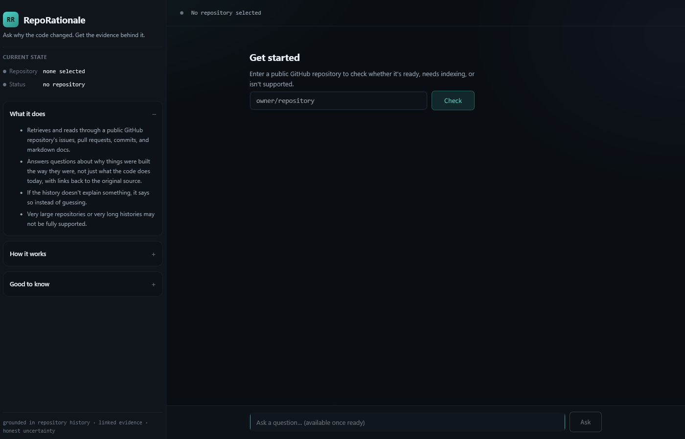
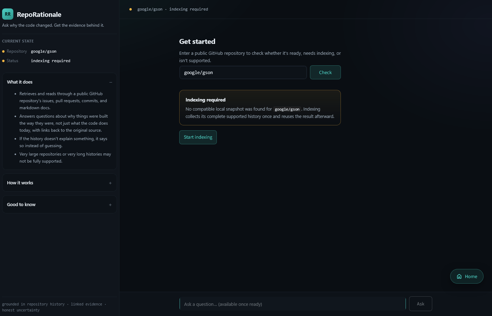
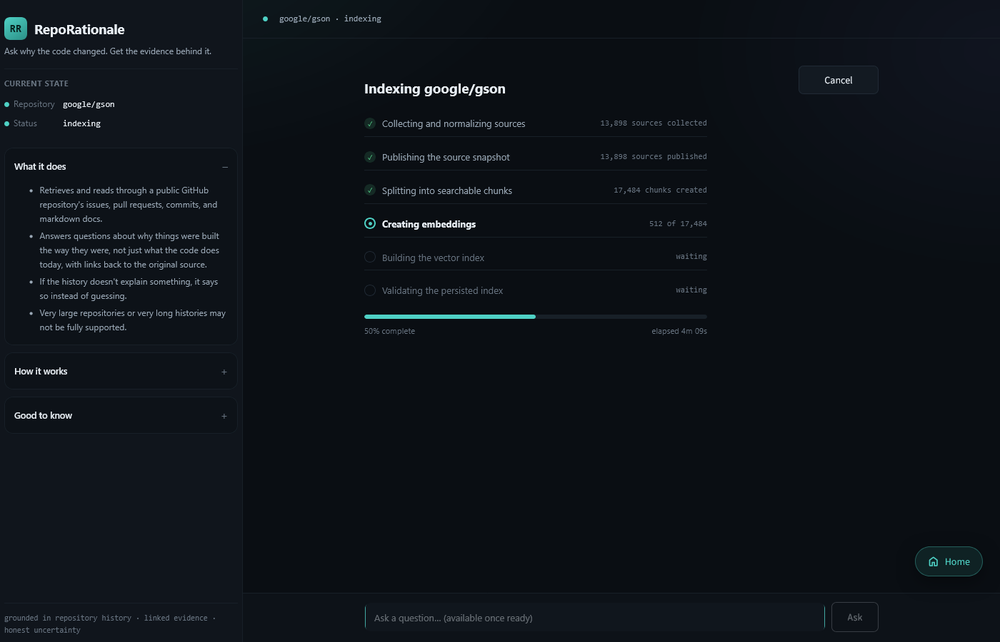
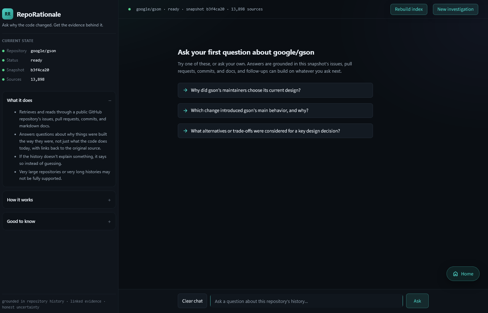
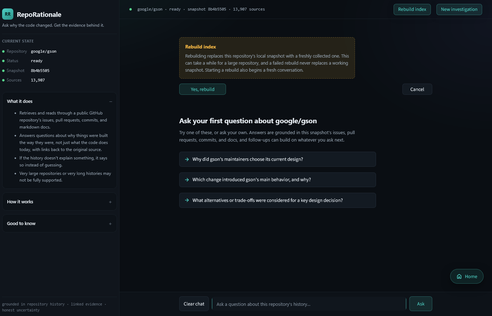
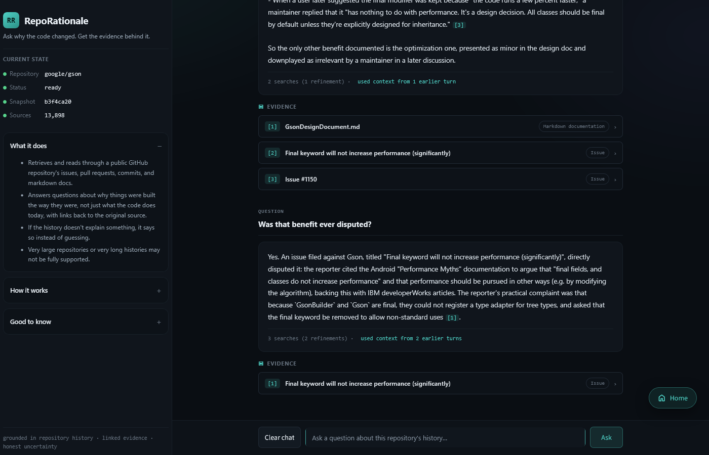
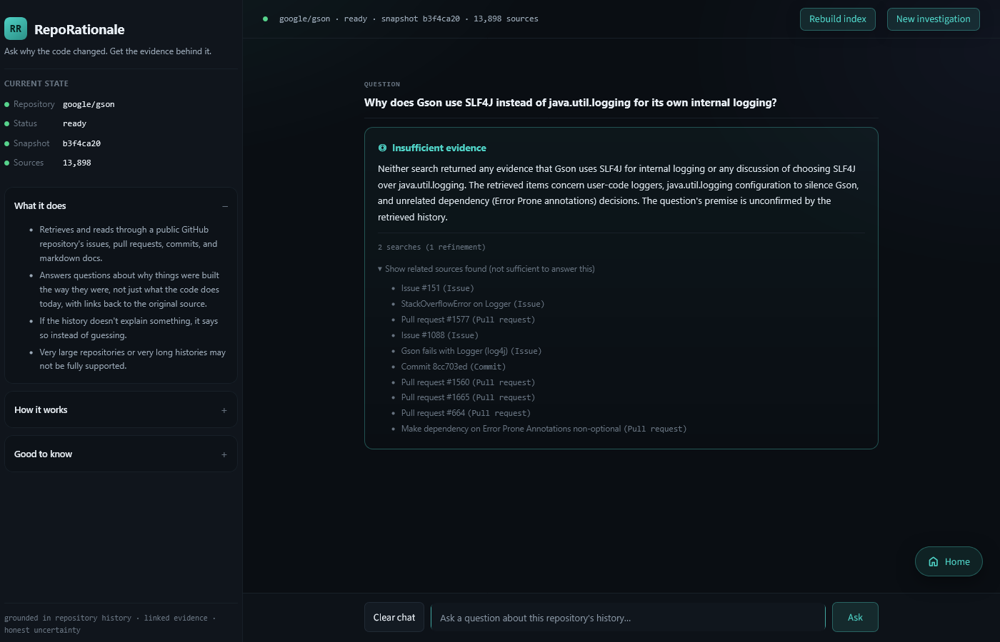
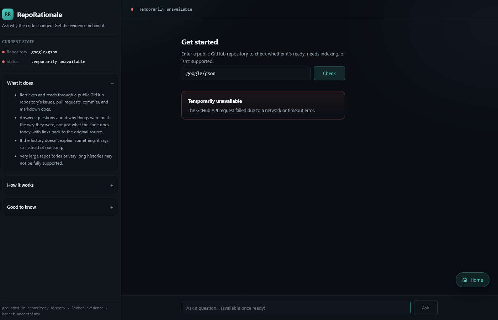
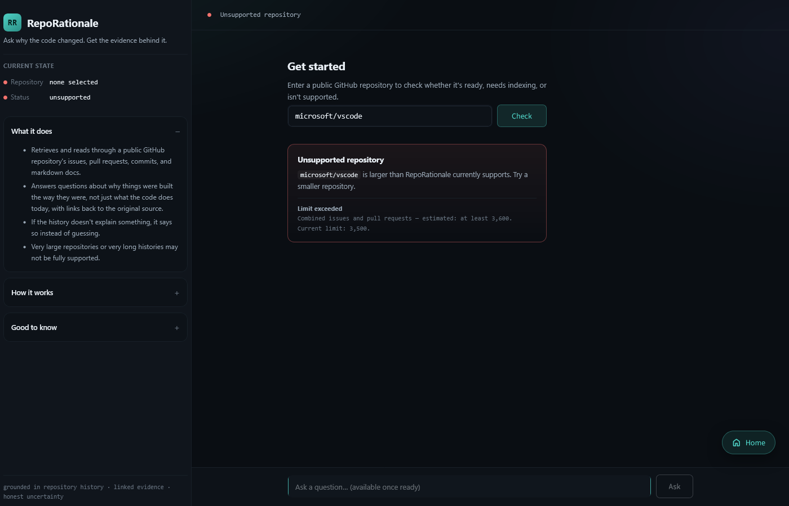

# RepoRationale: Product Walkthrough

This walkthrough shows the user-visible path through the Streamlit application,
from selecting a public GitHub repository to reviewing a grounded answer. Gson
is used as the example repository because its public history contains explicit
design rationale as well as issues, pull requests, commits, comments, and
documentation.

The screenshots explain the product experience rather than its implementation.
For product scope, see the [project definition](project.md). For technical
components and lifecycle contracts, see the [architecture](architecture.md).
Measured quality and performance results are reported in the
[evaluation](evaluation.md).

## 1. Start from Home

The initial screen asks for a public GitHub repository in `owner/repository`
form. No repository has been selected, so answering is unavailable. The sidebar
summarizes what the product does and keeps additional guidance collapsed until
the user chooses to open it.

  

<em>The default Home state, before entering a repository.</em>

## 2. Check a repository

After the user enters `google/gson`, RepoRationale checks whether a compatible
local snapshot is already available and whether a new index can be built within
the supported limits. In this example no compatible snapshot exists, so the
application explains that indexing is required and waits for confirmation
before starting the paid embedding work.

  

<em>Gson is supported, but no reusable local snapshot is available yet.</em>

## 3. Follow indexing progress

Indexing collects the supported repository history, publishes and validates the
source snapshot, creates searchable chunks, builds embeddings, and prepares the
vector index. The interface reports progress by phase and keeps question input
disabled until the complete index is ready.

  

<em>Completed, active, and waiting phases remain visible during a cold index build.</em>

## 4. Reuse a ready snapshot

When indexing completes, the application identifies the repository, snapshot,
and number of collected sources. The same ready state can be reopened in a
later application session when the local snapshot remains compatible, avoiding
another full collection and document-embedding run. From this state, `Rebuild
index` lets the user deliberately create a fresh index instead of reusing the
current one, while `New investigation` returns to repository selection.

  

<em>A ready Gson snapshot with suggested starting questions.</em>

### Optional: rebuild the index

Choosing `Rebuild index` opens a confirmation before any work starts. The
message explains that rebuilding recollects the repository, replaces the local
snapshot only after a successful build, and starts a fresh conversation. The
user can proceed or return to the existing ready snapshot.

  

<em>Rebuilding is an explicit action and a failed rebuild does not replace the working snapshot.</em>

## 5. Ask for the rationale behind a decision

The user can ask a natural-language question about why something changed. The
answer below explains why Gson's own classes were marked `final`, links each
claim to evidence retrieved from the repository history, and lets the user
expand the original source without leaving the investigation.

  

<em>A grounded answer with inspectable evidence from the selected repository snapshot.</em>

## 6. Continue with a contextual follow-up

Follow-up questions can refer to the current conversation. Here, “Was that
benefit ever disputed?” is resolved from the earlier discussion about marking
Gson classes `final`. Conversation context helps interpret the question, while
the new answer still depends on evidence retrieved for that turn.

  

<em>The follow-up uses session context and cites the historical issue that disputed the claim.</em>

## 7. Abstain when the history is insufficient

Related search results are not automatically treated as proof. The question
below assumes that Gson uses SLF4J for internal logging and asks why it was
chosen over `java.util.logging`. Retrieved history contains logging-related
items, but it does not establish that premise or document such a decision. The
application therefore returns `Insufficient evidence` and separates the related
sources from evidence sufficient to answer.

  

<em>An explicit abstention with related but insufficient repository sources still available for inspection.</em>

## Alternative outcome: Temporarily unavailable

A failed GitHub request is reported separately from repository support. A
network or timeout error leaves the repository in a temporarily unavailable
state, so the user can retry the check later instead of interpreting the
failure as an unsupported repository.

  

<em>A transient GitHub failure remains distinguishable from a product limit.</em>

## Alternative outcome: Unsupported repository

A repository may exceed the measured release limits before indexing begins. In
this example, the estimate for `microsoft/vscode` has already exceeded the
combined issue and pull-request limit. RepoRationale reports the specific
boundary and does not begin a partial index.

  

<em>An unsupported result is a deliberate boundary, not a failed or partially ready index.</em>

